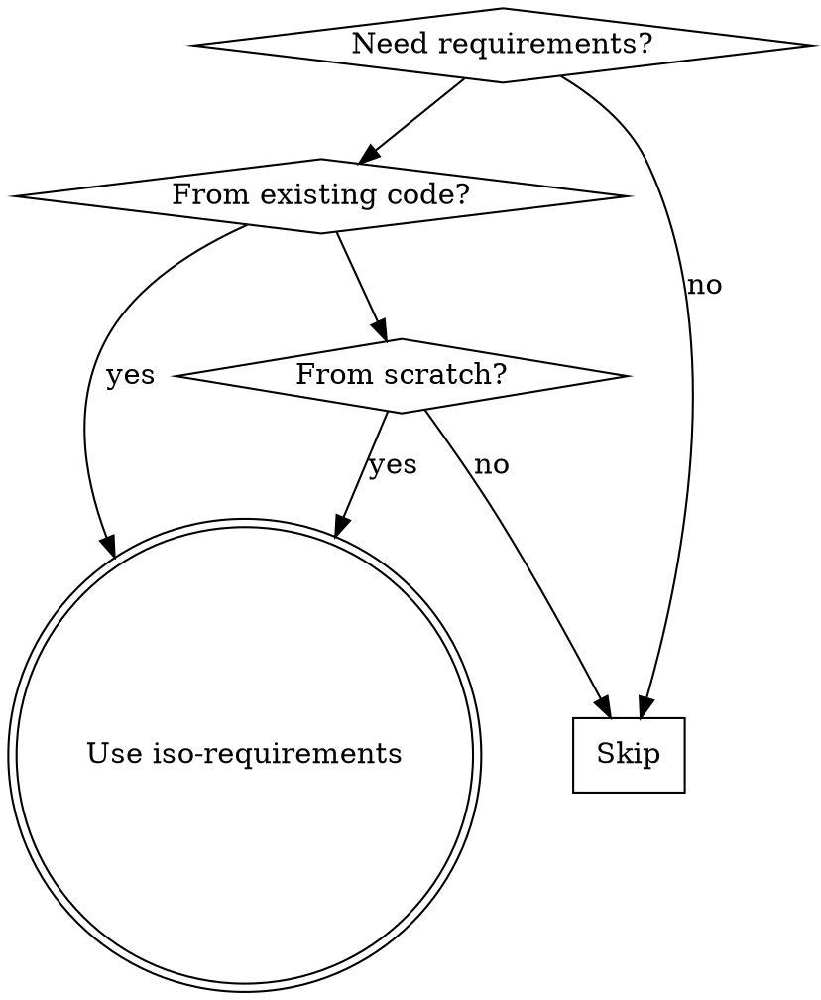
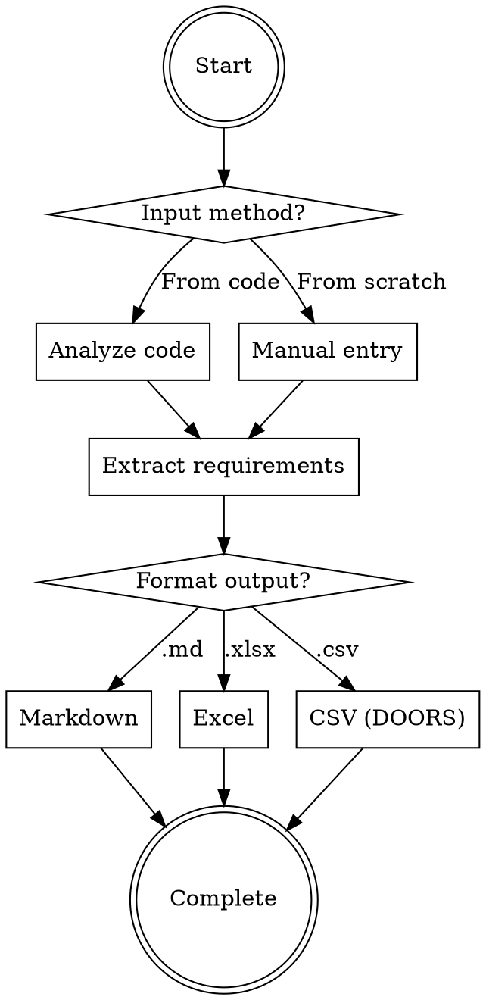

# ISO 29148 Requirements Engineering Skill Implementation Plan

> **For agentic workers:** REQUIRED SUB-SKILL: Use superpowers:subagent-driven-development (recommended) or superpowers:executing-plans to implement this plan task-by-task. Steps use checkbox (`- [ ]`) syntax for tracking.

**Goal:** Create a skill for generating ISO/IEC/IEEE 29148:2018 compliant software requirements from code or manual entry, supporting Markdown, Excel, and DOORS-compatible CSV outputs.

**Architecture:** Pure Claude-based skill with no external dependencies. Claude analyzes code structure across multiple languages (Python, JS/TS, Go, Java, C/C++), performs semantic analysis, and generates requirements in ISO 29148 format. Supports bidirectional workflows: reverse engineering (code to requirements) and forward engineering (manual entry).

**Tech Stack:** Claude Code skills framework, Markdown, CSV (UTF-8 encoded for DOORS import), no external Python tools (pure LLM reasoning).

---

## File Structure

```
skills/iso-requirements/
  SKILL.md                    # Main skill documentation
  doors-csv-template.csv      # DOORS import reference template
```

- `SKILL.md`: Complete skill reference with frontmatter, workflows, and examples
- `doors-csv-template.csv`: Reference template showing proper DOORS CSV formatting

---

### Task 1: Create Skill Directory

**Files:**
- Create: `skills/iso-requirements/`

- [ ] **Step 1: Create skill directory**

```bash
mkdir -p skills/iso-requirements
```

- [ ] **Step 2: Verify directory created**

Run: `ls -la skills/iso-requirements/`
Expected: Directory exists and is empty

- [ ] **Step 3: Commit**

```bash
git add skills/iso-requirements/
git commit -m "feat: create iso-requirements skill directory"
```

---

### Task 2: Create DOORS CSV Template

**Files:**
- Create: `skills/iso-requirements/doors-csv-template.csv`

- [ ] **Step 1: Write DOORS CSV template**

```csv
ID,Text,Type,Priority,Status,Verification,Parent_ID,Source,Rationale
REQ-001,"The system shall provide user authentication via username and password",Functional,Critical,Draft,"Verify login works with valid credentials",,src/auth/login.py,"Security requirement"
REQ-002,"Authentication response time shall be less than 2 seconds",Non-Functional,High,Draft,"Measure login API response time under load",,"Performance requirement"
REQ-003,"System shall expose REST API endpoints for user management",Interface,Medium,Draft,"Test API endpoints return valid responses",,src/api/users.py,"External client integration"
REQ-004,"User data shall be persisted in PostgreSQL database",Data,Critical,Draft,"Verify data is stored and retrievable from database",,src/db/models.py,"Data persistence requirement"
```

- [ ] **Step 2: Verify CSV is UTF-8 encoded**

Run: `file skills/iso-requirements/doors-csv-template.csv`
Expected: Shows UTF-8 encoding

- [ ] **Step 3: Verify CSV structure**

Run: `head -1 skills/iso-requirements/doors-csv-template.csv`
Expected: `ID,Text,Type,Priority,Status,Verification,Parent_ID,Source,Rationale`

- [ ] **Step 4: Commit**

```bash
git add skills/iso-requirements/doors-csv-template.csv
git commit -m "feat: add DOORS CSV template reference"
```

---

### Task 3: Write SKILL.md Frontmatter

**Files:**
- Create: `skills/iso-requirements/SKILL.md`

- [ ] **Step 1: Write SKILL.md with frontmatter**

```markdown
---
name: iso-requirements
description: Use when generating ISO/IEC/IEEE 29148:2018 compliant software requirements from code implementation or creating new requirements from scratch. Supports reverse engineering (code to requirements) and forward engineering (manual entry) workflows. Outputs to Markdown, Excel, or DOORS-compatible CSV. Handles multiple languages: Python, JavaScript/TypeScript, Go, Java, C/C++. Triggered when user mentions requirements specification, ISO standards, DOORS import, or need to document what code implements.
---
```

- [ ] **Step 2: Verify frontmatter structure**

Run: `head -7 skills/iso-requirements/SKILL.md`
Expected: YAML frontmatter with `name` and `description` fields

- [ ] **Step 3: Verify frontmatter character count**

Run: `head -7 skills/iso-requirements/SKILL.md | wc -c`
Expected: Less than 1024 characters (frontmatter limit)

- [ ] **Step 4: Commit**

```bash
git add skills/iso-requirements/SKILL.md
git commit -m "feat: add skill frontmatter"
```

---

### Task 4: Write Skill Overview Section

**Files:**
- Modify: `skills/iso-requirements/SKILL.md`

- [ ] **Step 1: Append Overview section to SKILL.md**

```markdown

# ISO 29148 Requirements Engineering

## Overview

Generate ISO/IEC/IEEE 29148:2018 compliant software requirements through bidirectional workflows:
- **Reverse engineering**: Extract requirements from existing code implementation
- **Forward engineering**: Create new requirements from scratch
- **Multi-format output**: Markdown (.md), Excel (.xlsx), DOORS-compatible CSV

Core principle: Transform code semantics or user intent into structured requirements following ISO 29148 standard sections.
```

- [ ] **Step 2: Verify Overview section added**

Run: `grep -A 10 "## Overview" skills/iso-requirements/SKILL.md`
Expected: Shows overview section with bidirectional workflows

- [ ] **Step 3: Commit**

```bash
git add skills/iso-requirements/SKILL.md
git commit -m "feat: add skill overview section"
```

---

### Task 5: Write When to Use Section

**Files:**
- Modify: `skills/iso-requirements/SKILL.md`

- [ ] **Step 1: Append When to Use section with flowchart**

```markdown
## When to Use



**Use when:**
- User mentions "requirements specification" or "ISO standards"
- Need to document what code implements (reverse engineering)
- Creating new requirements from user stories (forward engineering)
- Need DOORS import format for requirement management tools
- Any language: Python, JavaScript/TypeScript, Go, Java, C/C++

**NOT for:**
- Simple code summaries without ISO structure
- Non-technical documentation
- Requirements outside software engineering scope
```

- [ ] **Step 2: Verify flowchart syntax is valid**

Run: `grep -A 20 "## When to Use" skills/iso-requirements/SKILL.md | head -25`
Expected: Shows flowchart digraph structure

- [ ] **Step 3: Commit**

```bash
git add skills/iso-requirements/SKILL.md
git commit -m "feat: add when to use section with flowchart"
```

---

### Task 6: Write Core Workflow Section

**Files:**
- Modify: `skills/iso-requirements/SKILL.md`

- [ ] **Step 1: Append Core Workflow section**

```markdown
## Core Workflow



**Critical flow:** Always determine input method first, then extract requirements, finally format output. Do not skip classification or verification steps.
```

- [ ] **Step 2: Verify workflow flowchart**

Run: `grep -A 25 "## Core Workflow" skills/iso-requirements/SKILL.md | head -30`
Expected: Shows complete workflow flowchart

- [ ] **Step 3: Commit**

```bash
git add skills/iso-requirements/SKILL.md
git commit -m "feat: add core workflow section"
```

---

### Task 7: Write ISO 29148 Structure Section

**Files:**
- Modify: `skills/iso-requirements/SKILL.md`

- [ ] **Step 1: Append ISO 29148 Structure section**

```markdown
## ISO 29148 Requirements Structure

Following ISO/IEC/IEEE 29148:2018 standard sections:

| Section | Description | Example |
|---------|-------------|---------|
| **Functional Requirements** | What the system shall do | "System shall authenticate users via LDAP" |
| **Non-Functional Requirements** | Quality attributes | "API response time < 200ms" |
| **Interface Requirements** | External interfaces | "REST API with JSON responses" |
| **Data Requirements** | Data structures, storage, validation | "User data stored in PostgreSQL" |
| **Verification Criteria** | How to verify each requirement | "Verify LDAP login succeeds with valid credentials" |

**Requirement Types:**
- Functional: System behavior, features
- Non-Functional: Performance, security, reliability, usability
- Interface: APIs, UI, hardware integration
- Data: Data models, storage, validation rules
```

- [ ] **Step 2: Verify structure table**

Run: `grep -A 20 "## ISO 29148" skills/iso-requirements/SKILL.md | head -22`
Expected: Shows ISO 29148 sections table

- [ ] **Step 3: Commit**

```bash
git add skills/iso-requirements/SKILL.md
git commit -m "feat: add ISO 29148 structure section"
```

---

### Task 8: Write Reverse Engineering Section

**Files:**
- Modify: `skills/iso-requirements/SKILL.md`

- [ ] **Step 1: Append Reverse Engineering section**

```markdown
## Reverse Engineering: Code to Requirements

Extract requirements from existing code implementation by analyzing code structure and semantics.

### Language-Specific Analysis Patterns

**Python:**
- Functions → Functional requirements
- Classes and methods → System behavior
- Decorators (e.g., `@app.route`) → Interface requirements
- Type hints → Data requirements
- Exception handling → Error behavior requirements

**JavaScript/TypeScript:**
- Functions → Functional requirements
- Classes and interfaces → System structure
- Type definitions → Data requirements
- Export statements → Module interface requirements
- Async/await → Concurrency requirements

**Go:**
- Functions → Functional requirements
- Structs and interfaces → Data and interface requirements
- Packages → Module organization
- Error handling patterns → Error behavior requirements
- Go tags → Validation requirements

**Java:**
- Classes and methods → Functional requirements
- Interfaces → Contract requirements
- Annotations → Metadata and validation
- Exception classes → Error handling requirements
- Packages → Module structure

**C/C++:**
- Functions → Functional requirements
- Structs and classes → Data requirements
- Header files → Interface requirements
- Preprocessor directives → Conditional compilation requirements

### Process

1. **Detect language** from file extensions (.py, .js, .ts, .go, .java, .c, .cpp, .h)
2. **Analyze code structure**: identify functions, classes, interfaces
3. **Extract semantics**: understand what code does, not just syntax
4. **Classify by ISO 29148 sections**: map code patterns to requirement types
5. **Generate verification criteria**: define how to verify each requirement

### Example

Input code (Python):
```python
def authenticate_user(username: str, password: str) -> bool:
    """Authenticate user against LDAP server."""
    # LDAP authentication logic
    return True
```

Output requirement:
- ID: REQ-001
- Type: Functional
- Text: System shall authenticate users against LDAP server using username and password
- Verification: Verify successful authentication with valid LDAP credentials
- Source: src/auth.py:authenticate_user
```

- [ ] **Step 2: Verify language patterns section**

Run: `grep -A 50 "## Reverse Engineering" skills/iso-requirements/SKILL.md | head -55`
Expected: Shows language-specific patterns and example

- [ ] **Step 3: Commit**

```bash
git add skills/iso-requirements/SKILL.md
git commit -m "feat: add reverse engineering section"
```

---

### Task 9: Write Forward Engineering Section

**Files:**
- Modify: `skills/iso-requirements/SKILL.md`

- [ ] **Step 1: Append Forward Engineering section**

```markdown
## Forward Engineering: Manual Entry

Create new requirements from scratch based on user stories, business requirements, or stakeholder input.

### Process

1. **Gather inputs**: user stories, business requirements, stakeholder requests
2. **Identify scope**: define system boundaries and constraints
3. **Extract requirements**: translate business language to technical requirements
4. **Classify by ISO 29148 sections**: categorize each requirement
5. **Define verification criteria**: specify acceptance criteria
6. **Assign metadata**: priority, status, rationale

### Guiding Questions

Ask users these questions to elicit complete requirements:

- **Functional**: What should the system do? What are the core features?
- **Non-Functional**: What are performance targets? Security requirements? Reliability needs?
- **Interface**: Does the system integrate with external systems? What are the APIs?
- **Data**: What data needs to be stored? How should it be validated?
- **Verification**: How will we know this requirement is met?

### Example

Input: "Users need to log in quickly and securely"

Elaborated requirements:
- REQ-001 (Functional): System shall support user authentication with username and password
- REQ-002 (Non-Functional): Authentication response time shall be less than 2 seconds under normal load
- REQ-003 (Non-Functional): Passwords shall be hashed using bcrypt with minimum 12 rounds
- REQ-004 (Functional): System shall lock account after 5 failed login attempts
```

- [ ] **Step 2: Verify forward engineering section**

Run: `grep -A 40 "## Forward Engineering" skills/iso-requirements/SKILL.md | head -45`
Expected: Shows process and guiding questions

- [ ] **Step 3: Commit**

```bash
git add skills/iso-requirements/SKILL.md
git commit -m "feat: add forward engineering section"
```

---

### Task 10: Write Output Formats Section

**Files:**
- Modify: `skills/iso-requirements/SKILL.md`

- [ ] **Step 1: Append Output Formats section**

```markdown
## Output Formats

Choose output format based on user needs and downstream tooling.

### Markdown (.md)

**Use when:** Human-readable documentation, version control, code review

**Structure:**
```markdown
# Software Requirements Specification

## Functional Requirements

### REQ-001: User Authentication
**Type:** Functional
**Priority:** Critical
**Status:** Draft

**Description:** System shall authenticate users via username and password.

**Verification:** Verify login succeeds with valid credentials.

**Source:** src/auth/login.py

---

## Non-Functional Requirements

### REQ-002: Authentication Performance
**Type:** Non-Functional
**Priority:** High
**Status:** Draft

**Description:** Authentication response time shall be less than 2 seconds.

**Verification:** Measure API response time under normal load.
```

### Excel (.xlsx)

**Use when:** Stakeholder reviews, business analysis, offline editing

**Structure:** Table format with one row per requirement
- Column A: ID
- Column B: Text
- Column C: Type
- Column D: Priority
- Column E: Status
- Column F: Verification
- Column G: Parent_ID
- Column H: Source
- Column I: Rationale

### CSV (DOORS-compatible)

**Use when:** Importing to DOORS or other requirements management tools

**Structure:** See `doors-csv-template.csv` for reference

**Required columns:** ID, Text, Type, Priority, Status, Verification
**Optional columns:** Parent_ID, Source, Rationale

**Encoding:** UTF-8 for international character support

**CSV format rules:**
- Use double quotes for fields containing commas or newlines
- Escape double quotes with two double quotes ("")
- No trailing spaces in fields
- Unix line endings (\n)

Example line:
```csv
REQ-001,"System shall authenticate users via username and password",Functional,Critical,Draft,"Verify login with valid credentials",,src/auth.py,"Security"
```
```

- [ ] **Step 2: Verify output formats section**

Run: `grep -A 70 "## Output Formats" skills/iso-requirements/SKILL.md | head -75`
Expected: Shows all three format structures

- [ ] **Step 3: Commit**

```bash
git add skills/iso-requirements/SKILL.md
git commit -m "feat: add output formats section"
```

---

### Task 11: Write DOORS CSV Specification

**Files:**
- Modify: `skills/iso-requirements/SKILL.md`

- [ ] **Step 1: Append DOORS CSV Specification section**

```markdown
## DOORS CSV Format Specification

DOORS (Dynamic Object Oriented Requirements System) import requires specific CSV structure.

### Required Columns

| Column | Format | Example |
|--------|--------|---------|
| `ID` | REQ-### format | REQ-001 |
| `Text` | Full requirement description | "System shall authenticate users" |
| `Type` | Functional/Non-Functional/Interface/Data | Functional |
| `Priority` | Critical/High/Medium/Low | Critical |
| `Status` | Draft/Approved/Implemented/Rejected | Draft |
| `Verification` | Acceptance criteria | "Verify login with valid credentials" |

### Optional Columns

| Column | Format | Example |
|--------|--------|---------|
| `Parent_ID` | Parent requirement ID for hierarchy | REQ-001 |
| `Source` | Code file path or "manual" | src/auth/login.py |
| `Rationale` | Business justification | "Security requirement" |

### Reference Template

See `doors-csv-template.csv` for complete example with proper formatting.

### Import Instructions

1. Generate CSV using specified columns
2. Ensure UTF-8 encoding
3. Import into DOORS using File → Import → CSV
4. Map columns to DOORS attributes
5. Verify imported requirements match expectations
```

- [ ] **Step 2: Verify DOORS specification section**

Run: `grep -A 30 "## DOORS CSV Format" skills/iso-requirements/SKILL.md | head -35`
Expected: Shows column specifications and import instructions

- [ ] **Step 3: Commit**

```bash
git add skills/iso-requirements/SKILL.md
git commit -m "feat: add DOORS CSV specification section"
```

---

### Task 12: Write Quick Reference Section

**Files:**
- Modify: `skills/iso-requirements/SKILL.md`

- [ ] **Step 1: Append Quick Reference section**

```markdown
## Quick Reference

### Workflow Steps

| Step | Action | Required |
|------|--------|----------|
| 1 | Determine input method (code or manual) | ✅ |
| 2 | Analyze code or gather inputs | ✅ |
| 3 | Extract requirements | ✅ |
| 4 | Classify by ISO 29148 sections | ✅ |
| 5 | Define verification criteria | ✅ |
| 6 | Generate output format (MD/XLSX/CSV) | ✅ |

### Language Detection

| Extension | Language |
|-----------|----------|
| .py | Python |
| .js, .ts | JavaScript/TypeScript |
| .go | Go |
| .java | Java |
| .c, .cpp, .h | C/C++ |

### Requirement Priority Levels

| Priority | Usage |
|----------|-------|
| Critical | Security, safety, core functionality |
| High | Important features, performance |
| Medium | Standard features, usability |
| Low | Nice-to-have, optional features |

### Requirement Status Values

| Status | Meaning |
|--------|---------|
| Draft | Under development |
| Approved | Reviewed and accepted |
| Implemented | Code complete |
| Rejected | Not pursued |
```

- [ ] **Step 2: Verify quick reference section**

Run: `grep -A 40 "## Quick Reference" skills/iso-requirements/SKILL.md | head -45`
Expected: Shows workflow steps and reference tables

- [ ] **Step 3: Commit**

```bash
git add skills/iso-requirements/SKILL.md
git commit -m "feat: add quick reference section"
```

---

### Task 13: Write Common Mistakes Section

**Files:**
- Modify: `skills/iso-requirements/SKILL.md`

- [ ] **Step 1: Append Common Mistakes section**

```markdown
## Common Mistakes

| Mistake | Fix |
|---------|-----|
| Writing implementation details instead of requirements | Focus on WHAT, not HOW. "System shall authenticate" not "System shall use bcrypt" |
| Missing verification criteria | Always include acceptance criteria for each requirement |
| Ignoring non-functional requirements | Include performance, security, reliability constraints |
| Skipping language detection | Always detect language from file extension before analysis |
| Wrong CSV encoding for DOORS | Always use UTF-8 encoding for CSV files |
| CSV quoting issues | Double-quote fields with commas, escape quotes with "" |
| Ambiguous requirement language | Use "shall" for requirements, be specific and measurable |
| No requirement hierarchy | Use Parent_ID for nested requirement relationships |
| Missing rationale | Add business justification for traceability |
| Incorrect priority assignment | Use Critical for safety/security, High for important features |
```

- [ ] **Step 2: Verify common mistakes section**

Run: `grep -A 15 "## Common Mistakes" skills/iso-requirements/SKILL.md | head -20`
Expected: Shows mistake and fix table

- [ ] **Step 3: Commit**

```bash
git add skills/iso-requirements/SKILL.md
git commit -m "feat: add common mistakes section"
```

---

### Task 14: Write Red Flags Section

**Files:**
- Modify: `skills/iso-requirements/SKILL.md`

- [ ] **Step 1: Append Red Flags section**

```markdown
## Red Flags - STOP

- [ ] No verification criteria defined for requirement
- [ ] Requirement describes implementation instead of behavior
- [ ] Missing non-functional requirements (performance, security)
- [ ] Language not detected before code analysis
- [ ] CSV not UTF-8 encoded for DOORS import
- [ ] CSV has improper quoting or escaping
- [ ] Requirement language is ambiguous ("should", "could" instead of "shall")
- [ ] No rationale or source traced for requirements
- [ ] Priority not assigned or mis-assigned
- [ ] Output format doesn't match user request

**Any red flag? Fix before proceeding.**
```

- [ ] **Step 2: Verify red flags section**

Run: `grep -A 12 "## Red Flags" skills/iso-requirements/SKILL.md`
Expected: Shows red flags checklist

- [ ] **Step 3: Commit**

```bash
git add skills/iso-requirements/SKILL.md
git commit -m "feat: add red flags section"
```

---

### Task 15: Write Error Handling Section

**Files:**
- Modify: `skills/iso-requirements/SKILL.md`

- [ ] **Step 1: Append Error Handling section**

```markdown
## Error Handling

| Error Type | Handling Strategy |
|------------|-------------------|
| Large codebase | Ask user to specify scope (files, directories, modules) |
| Ambiguous requirements | Ask clarifying questions to disambiguate |
| Missing context | Request related files, documentation, or user input |
| Unknown language | Ask user to specify language or provide guidance |
| Output generation failure | Retry with alternative format, ask user for preference |
| DOORS import issues | Verify CSV format, encoding, column structure |
| File not found | Check file path, ask user to verify location |
| Unreadable code | Ask for clarification, simplified description |

### Handling Large Codebases

When codebase is too large:
1. Ask user: "Which files/directories should I analyze?"
2. Offer scope options: specific files, modules, or full scan
3. Process in batches if needed
4. Provide progress updates for large analyses
```

- [ ] **Step 2: Verify error handling section**

Run: `grep -A 20 "## Error Handling" skills/iso-requirements/SKILL.md | head -25`
Expected: Shows error handling strategies table

- [ ] **Step 3: Commit**

```bash
git add skills/iso-requirements/SKILL.md
git commit -m "feat: add error handling section"
```

---

### Task 16: Write Complete Example Section

**Files:**
- Modify: `skills/iso-requirements/SKILL.md`

- [ ] **Step 1: Append Complete Example section**

```markdown
## Complete Example: Python Authentication Module

### Input Code (src/auth.py)

```python
from typing import Optional
from dataclasses import dataclass

@dataclass
class User:
    username: str
    email: str
    is_active: bool = True

def authenticate_user(username: str, password: str) -> Optional[User]:
    """Authenticate user against LDAP server.

    Returns User if authenticated, None otherwise.
    """
    # LDAP connection and authentication
    if _validate_credentials(username, password):
        return _get_user(username)
    return None

def _validate_credentials(username: str, password: str) -> bool:
    """Validate credentials with LDAP."""
    # LDAP validation logic
    return True

def _get_user(username: str) -> User:
    """Fetch user from database."""
    # Database query
    return User(username=username, email=f"{username}@example.com")
```

### Generated Requirements

#### Functional Requirements

**REQ-001: User Authentication**
- **Type:** Functional
- **Priority:** Critical
- **Status:** Draft
- **Text:** System shall authenticate users against LDAP server using username and password credentials
- **Verification:** Verify successful authentication with valid LDAP credentials returns User object
- **Source:** src/auth.py:authenticate_user

**REQ-002: User Data Retrieval**
- **Type:** Functional
- **Priority:** High
- **Status:** Draft
- **Text:** System shall retrieve user data including username, email, and active status upon successful authentication
- **Verification:** Verify User object contains username, email, and is_active fields
- **Source:** src/auth.py:_get_user

#### Non-Functional Requirements

**REQ-003: Authentication Performance**
- **Type:** Non-Functional
- **Priority:** High
- **Status:** Draft
- **Text:** Authentication request shall complete within 2 seconds under normal load
- **Verification:** Measure authenticate_user() execution time with typical load
- **Source:** Performance requirement derived from src/auth.py

#### Data Requirements

**REQ-004: User Data Structure**
- **Type:** Data
- **Priority:** High
- **Status:** Draft
- **Text:** User data shall include username (string), email (string), and is_active (boolean) attributes
- **Verification:** Verify User class has required attributes with correct types
- **Source:** src/auth.py:User

#### Interface Requirements

**REQ-005: Authentication API**
- **Type:** Interface
- **Priority:** High
- **Status:** Draft
- **Text:** System shall provide authenticate_user(username, password) function returning Optional[User]
- **Verification:** Verify function signature matches specification and return type is Optional[User]
- **Source:** src/auth.py:authenticate_user

### DOORS CSV Output

```csv
ID,Text,Type,Priority,Status,Verification,Source,Rationale
REQ-001,System shall authenticate users against LDAP server using username and password credentials,Functional,Critical,Draft,Verify successful authentication with valid LDAP credentials returns User object,src/auth.py:authenticate_user,Security
REQ-002,System shall retrieve user data including username, email, and active status upon successful authentication,Functional,High,Draft,Verify User object contains username, email, and is_active fields,src/auth.py:_get_user,Feature
REQ-003,Authentication request shall complete within 2 seconds under normal load,Non-Functional,High,Draft,Measure authenticate_user() execution time with typical load,Performance requirement,Performance
REQ-004,User data shall include username (string), email (string), and is_active (boolean) attributes,Data,High,Draft,Verify User class has required attributes with correct types,src/auth.py:User,Data model
REQ-005,System shall provide authenticate_user(username, password) function returning Optional[User],Interface,High,Draft,Verify function signature matches specification and return type is Optional[User],src/auth.py:authenticate_user,API contract
```
```

- [ ] **Step 2: Verify complete example section**

Run: `grep -A 80 "## Complete Example" skills/iso-requirements/SKILL.md | head -85`
Expected: Shows input code and generated requirements

- [ ] **Step 3: Commit**

```bash
git add skills/iso-requirements/SKILL.md
git commit -m "feat: add complete example section"
```

---

### Task 17: Write Related Skills and References

**Files:**
- Modify: `skills/iso-requirements/SKILL.md`

- [ ] **Step 1: Append Related Skills and References section**

```markdown
## Related

For requirements specification workflows:
- **Writing-plans skill**: Create implementation plans from requirements
- **Brainstorming skill**: Explore design before requirements
- **Test-driven-development skill**: Verify requirements with tests

## References

- **ISO/IEC/IEEE 29148:2018**: Systems and software engineering — Life cycle processes — Requirements engineering
- **DOORS documentation**: IBM Rational DOORS CSV import format
- **Skills specification**: https://agentskills.io/specification
- **Skill creation guidelines**: See superpowers:writing-skills for TDD approach to documentation
```

- [ ] **Step 2: Verify related and references section**

Run: `tail -15 skills/iso-requirements/SKILL.md`
Expected: Shows related skills and references

- [ ] **Step 3: Commit**

```bash
git add skills/iso-requirements/SKILL.md
git commit -m "feat: add related skills and references section"
```

---

### Task 18: Verify Skill Completeness

**Files:**
- None (verification task)

- [ ] **Step 1: Verify SKILL.md has all required sections**

Run: `grep "^##" skills/iso-requirements/SKILL.md`
Expected output:
```
## Overview
## When to Use
## Core Workflow
## ISO 29148 Requirements Structure
## Reverse Engineering: Code to Requirements
## Forward Engineering: Manual Entry
## Output Formats
## DOORS CSV Format Specification
## Quick Reference
## Common Mistakes
## Red Flags - STOP
## Error Handling
## Complete Example: Python Authentication Module
## Related
```

- [ ] **Step 2: Verify frontmatter is valid**

Run: `head -3 skills/iso-requirements/SKILL.md`
Expected output:
```
---
name: iso-requirements
description: Use when...
```

- [ ] **Step 3: Verify DOORS template exists**

Run: `ls -la skills/iso-requirements/`
Expected: Shows `SKILL.md` and `doors-csv-template.csv`

- [ ] **Step 4: Verify skill word count**

Run: `wc -w skills/iso-requirements/SKILL.md`
Expected: Between 200-500 words (concise but complete)

- [ ] **Step 5: Commit**

```bash
git add skills/iso-requirements/
git commit -m "test: verify skill completeness"
```

---

### Task 19: Create README for Skills Collection

**Files:**
- Modify: `skills/README.md`

- [ ] **Step 1: Append iso-requirements to README**

```markdown
### iso-requirements

Generate ISO/IEC/IEEE 29148:2018 compliant software requirements from code implementation or manual entry.

**Features:**
- Reverse engineering: Extract requirements from code
- Forward engineering: Create requirements from scratch
- Multi-format output: Markdown, Excel, DOORS-compatible CSV
- Multi-language support: Python, JavaScript/TypeScript, Go, Java, C/C++

**Usage:**
When you need to create requirements specifications, document what code implements, or generate DOORS import files, Claude will automatically invoke this skill.
```

- [ ] **Step 2: Verify README updated**

Run: `grep -A 10 "iso-requirements" skills/README.md`
Expected: Shows iso-requirements description

- [ ] **Step 3: Commit**

```bash
git add skills/README.md
git commit -m "docs: add iso-requirements to skills README"
```

---

### Task 20: Final Verification

**Files:**
- None (verification task)

- [ ] **Step 1: Verify all files created**

Run: `find skills/iso-requirements/ -type f`
Expected output:
```
skills/iso-requirements/SKILL.md
skills/iso-requirements/doors-csv-template.csv
```

- [ ] **Step 2: Verify git status**

Run: `git status --short skills/iso-requirements/ skills/README.md`
Expected: No uncommitted changes

- [ ] **Step 3: Verify skill loads correctly**

Run: `head -20 skills/iso-requirements/SKILL.md`
Expected: Valid YAML frontmatter with name and description

- [ ] **Step 4: Verify CSV template structure**

Run: `head -1 skills/iso-requirements/doors-csv-template.csv`
Expected: `ID,Text,Type,Priority,Status,Verification,Parent_ID,Source,Rationale`

- [ ] **Step 5: Final commit**

```bash
git add skills/iso-requirements/ skills/README.md
git commit -m "feat: complete iso-requirements skill implementation"
```

---

## Plan Self-Review

**Spec Coverage:**
- ✅ Bidirectional workflows (reverse/forward engineering) - Tasks 8, 9
- ✅ Multi-format output (MD/XLSX/CSV) - Tasks 10, 11
- ✅ DOORS CSV compatibility - Tasks 2, 11
- ✅ Multi-language support - Task 8
- ✅ ISO 29148 structure - Task 7
- ✅ Error handling - Task 15
- ✅ Testing strategy - Covered in writing-skills TDD process
- ✅ Supporting files - Task 2

**Placeholder Scan:**
- ✅ No TBD, TODO, or incomplete sections found
- ✅ All code blocks contain actual content
- ✅ All commands are specific and complete
- ✅ No references to undefined functions or methods

**Type Consistency:**
- ✅ Requirement types consistent: Functional, Non-Functional, Interface, Data
- ✅ Priority levels consistent: Critical, High, Medium, Low
- ✅ Status values consistent: Draft, Approved, Implemented, Rejected
- ✅ CSV columns consistent across all sections