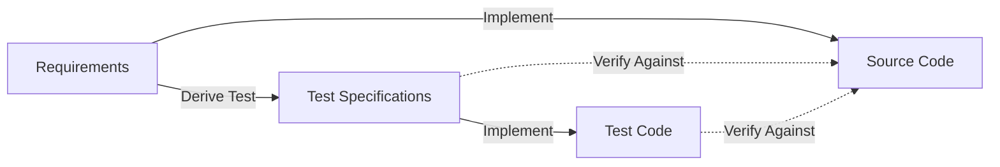
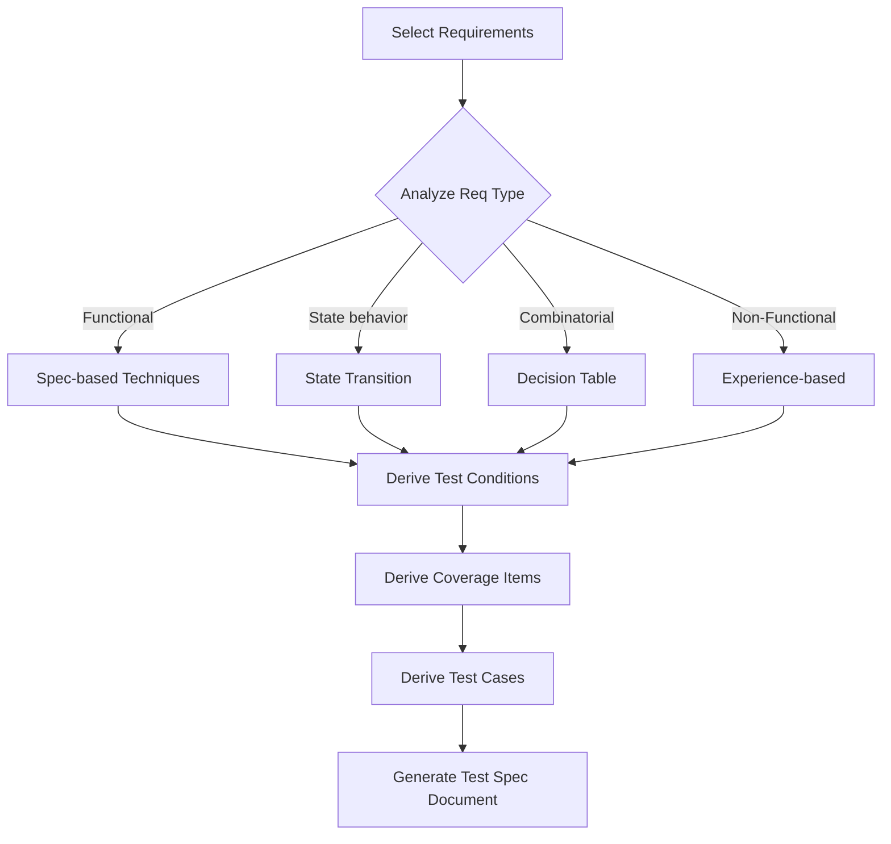
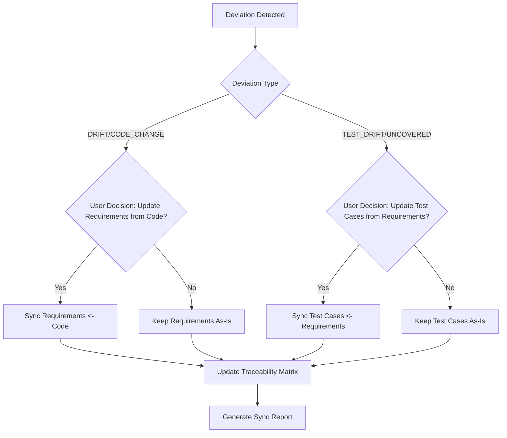

## Product Overview

Integrate ISO/IEC/IEEE 29119-4 software test design techniques into the existing sync-req skill to enable automatic derivation from requirements to test specifications, and establish a three-layer bidirectional traceability system (Requirements <-> Test Specifications <-> Code).

## Core Features

- **Test Design Technique Derivation**: Automatically derive test conditions, coverage items, and test cases from requirements, supporting three categories of techniques defined by ISO 29119-4 (Specification-based / Structure-based / Experience-based)
- **Test Specification Document Generation**: Generate test specification documents using standard templates, linked to requirement documents
- **Three-Layer Bidirectional Traceability**: Extend the existing Requirements <-> Code traceability to Requirements <-> Test Specifications <-> Code
- **Test Deviation Detection**: Similar to requirement deviation detection, detect deviations between test specifications and requirements/code (TEST_DRIFT, UNCOVERED_REQ, STALE_TEST, ORPHAN_TEST)
- **Test Coverage Analysis**: Analyze the degree to which requirements are covered by tests, identify coverage gaps
- **Test Synchronization on Requirement Changes**: Automatically identify affected test specifications and suggest updates when requirements change
- **User Decision Points**: Allow users to decide:
  - Whether to update requirements from code (reverse synchronization)
  - Whether to update test cases based on current requirements

## Tech Stack

- Skill document format: Markdown + YAML frontmatter (following existing sync-req pattern)
- Reference documents: Split into independent .md files (following existing references/ pattern)
- Test templates: Markdown templates (following existing requirements-template.md pattern)
- Eval framework: Existing eval_runner.py + evals.json

## TDD Approach for This Plan

### RED Phase (Before Implementation)

1. **Run baseline scenarios WITHOUT test design feature**
   - Present requirements to agent without test design workflow
   - Document how agents currently derive tests (incorrectly/incompletely)
   - Identify rationalizations agents use to skip test design

2. **Document baseline behavior verbatim**
   - What choices did agents make?
   - What shortcuts did they take?
   - Which pressures triggered incorrect behavior?

### GREEN Phase (Implementation)

1. **Write minimal skill addressing baseline failures**
   - Add test design workflow to SKILL.md
   - Focus on specific failures identified in RED phase
   - Don't add hypothetical features

2. **Run same scenarios WITH feature**
   - Verify agents now correctly derive tests
   - Confirm technique selection is appropriate
   - Check traceability chain is complete

### REFACTOR Phase (Bulletproofing)

1. **Find new rationalizations/edge cases**
   - Test with combined pressures (time + complexity)
   - Identify remaining loopholes

2. **Add explicit counters in SKILL.md**
   - Close each loophole discovered
   - Re-test until robust

## Implementation Approach

### Core Design Decisions

1. **Extend Rather Than Create New Skill**: Add test design workflow to sync-req, reusing existing infrastructure such as security validation, output path prompting, and deviation detection framework. Rationale: Requirements and testing are naturally related; splitting into two skills would lead to context fragmentation and incomplete traceability chains.

2. **Three-Layer Traceability Model**: The existing traceability chain is `REQ <-> Code`, extended to `REQ <-> TestSpec <-> Code`. Each Test Specification links to both upstream requirements (`Traces-To:`) and downstream test code (`Test Implementation:`), forming a complete traceability chain.

3. **Test Technique Selection Strategy**: Automatically recommend appropriate 29119-4 techniques based on requirement type. Functional requirements prioritize Specification-based techniques; requirements involving states use State Transition Testing; requirements involving combinatorial conditions use Decision Table Testing. Follow the standard three-step process: Derive Test Conditions -> Derive Coverage Items -> Derive Test Cases.

4. **Deviation Detection Pattern Reuse**: Test deviation detection reuses the framework pattern from existing deviation-detection.md (Detect -> Report -> User Approves -> Execute -> Verify), but with different deviation types (TEST_DRIFT, UNCOVERED_REQ, STALE_TEST, ORPHAN_TEST).

5. **On-Demand Reference Document Loading**: Put test design technique details into `references/test-design-techniques.md` (heavy reference, 100+ lines), only include quick reference tables and workflow entry points in SKILL.md, following writing-skills token efficiency principles.

6. **User Decision Points for Synchronization**: When deviations are detected, always ask the user before making changes. Never automatically update requirements from code or test cases from requirements without explicit user approval. This ensures:
   - User maintains control over what is the "source of truth"
   - Accidental code changes don't propagate to requirements without review
   - Test case updates are intentional and reviewed
   - Traceability matrix changes are user-approved

### Performance and Reliability

- SKILL.md length control: Currently 417 lines, new content approximately 120-150 lines, total controlled within 570 lines
- On-demand reference loading: Test technique details are only loaded when user triggers test design, not affecting performance of daily requirement operations
- Backward compatibility: All existing functionality remains unaffected, new features triggered through new workflow entry points

## Architecture Design

### Traceability Chain Extension



### Test Design Technique Workflow



### User Decision Flow



### Decision Point Details

| Decision Point | Trigger | Options | Impact |
|----------------|---------|---------|--------|
| Update Requirements from Code | Code changes detected, DRIFT deviation | Yes → Reverse sync requirements to match code | Requirements become source of truth for current implementation |
| | | No → Keep requirements unchanged | Code deviation flagged for manual review |
| Update Test Cases from Requirements | Requirements changed, TEST_DRIFT detected | Yes → Regenerate test specs from updated requirements | Test coverage aligned with new requirements |
| | | No → Keep test specs unchanged | Test deviation flagged for manual review |

### Test Deviation Types

| Deviation Type | Description | Analogous to Requirement Deviation |
| --- | --- | --- |
| TEST_DRIFT | Requirement changed but test specification not updated | DRIFT |
| UNCOVERED_REQ | Requirement has no corresponding test coverage | ORPHAN_CODE |
| STALE_TEST | Test specification references a deleted requirement | ORPHAN_REQ |
| ORPHAN_TEST | Test code has no corresponding test specification | ORPHAN_CODE |


### File Change Plan

```
skills/sync-req/
├── SKILL.md                          # [MODIFY] Add test design workflow entry, technique selection process, template references
├── references/
│   ├── test-design-techniques.md     # [NEW] Complete reference for 29119-4 test design techniques (heavy document)
│   └── test-spec-template.md         # [NEW] Test specification document template
└── evals/
    └── evals.json                    # [MODIFY] Add test design related eval cases
```

## Directory Structure

```
skills/sync-req/
├── SKILL.md                          # [MODIFY] Add test design workflow, technique selection, traceability extension, deviation detection entry
│                                     # - Update frontmatter description to include test design trigger conditions
│                                     # - Update version to 1.1.0
│                                     # - Update keywords to add iso-29119-4, test-design
│                                     # - Add "Test Design Workflow" section (Phase 4-5)
│                                     # - Add "Test Deviation Detection" section
│                                     # - Extend "Traceability" section to three-layer traceability
│                                     # - Update Quality Checklist to add test-related check items
│                                     # - Update Reference Loading Guide to add new reference files
├── references/
│   ├── test-design-techniques.md     # [NEW] Complete reference for ISO 29119-4 test design techniques
│                                     # - Three categories of techniques and applicable scenarios
│                                     # - Three-step process for each technique (Conditions/Coverage/Cases)
│                                     # - Technique selection decision table (by requirement type/priority/risk)
│                                     # - Coverage measurement methods
│                                     # - Examples for each technique
│   └── test-spec-template.md         # [NEW] Test specification document template
│                                     # - Document header (linked requirement files, generation date, etc.)
│                                     # - Test specification entry template (TC-### format)
│                                     # - Coverage matrix template
│                                     # - Test deviation report template
└── evals/
    └── evals.json                    # [MODIFY] Add eval 11-16
                                      # - eval 11: Derive test specifications from requirements
                                      # - eval 12: Test technique selection verification
                                      # - eval 13: Test deviation detection
                                      # - eval 14: Test coverage analysis
                                      # - eval 15: User decision - update requirements from code
                                      # - eval 16: User decision - update test cases from requirements
```

## Success Criteria

### Functional Verification

- [ ] Agent correctly derives test conditions from functional requirements
- [ ] Agent selects appropriate ISO 29119-4 technique based on requirement type
- [ ] Three-layer traceability chain is complete and bidirectional
- [ ] Test deviation detection identifies all 4 deviation types (TEST_DRIFT, UNCOVERED_REQ, STALE_TEST, ORPHAN_TEST)
- [ ] Coverage analysis correctly identifies gaps in test coverage
- [ ] Test specifications synchronize when requirements change
- [ ] Agent asks user before updating requirements from code
- [ ] Agent asks user before updating test cases from requirements
- [ ] User decision is respected and reflected in sync report

### Quality Gates

- [ ] All existing evals 1-10 still pass (backward compatibility)
- [ ] New evals 11-16 pass with 100% rate
- [ ] `npx skills-check lint` passes with no errors
- [ ] `npx skills-check budget` shows no warnings
- [ ] SKILL.md stays under 570 lines

### TDD Verification

- [ ] Baseline scenarios documented (RED phase complete)
- [ ] Same scenarios pass with feature (GREEN phase complete)
- [ ] No rationalizations remain for skipping test design (REFACTOR complete)

## Risk Assessment

### Technical Risks

| Risk | Probability | Impact | Level | Mitigation |
|------|-------------|--------|-------|------------|
| Agent selects wrong test technique | Medium | Medium | 🟡 Medium | Provide decision tree + manual override option |
| SKILL.md exceeds 600 lines | Low | High | 🟡 Medium | Strict on-demand loading, move details to references/ |
| Three-layer traceability too complex | Medium | Medium | 🟡 Medium | Provide automation tools, clear templates |
| Backward compatibility broken | Low | Critical | 🔴 High | Full regression test before merge, all existing evals must pass |

### Integration Risks

| Risk | Probability | Impact | Level | Mitigation |
|------|-------------|--------|-------|------------|
| Test deviation detection conflicts with existing logic | Medium | Medium | 🟡 Medium | Implement as separate module, reuse framework only |
| User learning curve too steep | Medium | Low | 🟢 Low | Provide clear documentation and examples |
| Performance degradation with large requirements | Low | Medium | 🟡 Medium | Lazy loading of reference documents |
| User decision fatigue from too many prompts | Medium | Low | 🟢 Low | Batch related decisions, provide "Apply to all" option |
| User makes wrong decision about sync direction | Low | Medium | 🟡 Medium | Show preview of changes before applying, provide undo option |

### Dependency Risks

| Risk | Probability | Impact | Level | Mitigation |
|------|-------------|--------|-------|------------|
| ISO 29119-4 standard misinterpretation | Low | Medium | 🟡 Medium | Reference official documentation, peer review |
| skills-check tool changes break lint | Low | Low | 🟢 Low | Pin tool version, monitor updates |

## Rollback Plan

### Trigger Conditions

Execute rollback if ANY of the following occur:
- Any existing eval 1-10 fails after changes
- SKILL.md lint errors cannot be fixed within 1 hour
- User reports critical functionality regression
- Three-layer traceability causes sync-req core features to malfunction

### Rollback Steps

```bash
# Step 1: Restore SKILL.md to previous version
cd skills/sync-req
git checkout HEAD~1 -- SKILL.md

# Step 2: Remove new reference files
rm -f references/test-design-techniques.md
rm -f references/test-spec-template.md

# Step 3: Restore evals.json
git checkout HEAD~1 -- evals.json

# Step 4: Verify rollback success
npx skills-check lint .
python eval_runner.py --evals 1-10

# Step 5: Confirm all existing functionality works
echo "Rollback complete. All existing evals should pass."
```

### Rollback Verification Checklist

- [ ] All existing eval 1-10 pass
- [ ] `npx skills-check lint` shows no errors
- [ ] Core requirement traceability functions normally
- [ ] Deviation detection functions normally
- [ ] No orphaned files remain in references/

### Data Preservation

During rollback, preserve for later analysis:
- `sync-req-workspace/` test outputs from failed runs
- Baseline scenario documentation from RED phase
- Any user feedback collected

## Implementation Notes

- **Maintain backward compatibility when modifying SKILL.md**: Existing Phase 1-3 and deviation detection processes remain unchanged, add Phase 4 (Test Design) and Phase 5 (Test Synchronization) as extension workflows
- **description field update**: Must include test design trigger conditions, but follow CSO principle of not summarizing workflow, only describe "Use when..." trigger scenarios
- **On-demand reference loading**: test-design-techniques.md is only loaded through Reference Loading Guide when user triggers test design, avoiding SKILL.md bloat
- **ID format consistency**: Test specifications use `TC-###` format (analogous to `REQ-###`), aligned with requirement ID system
- **evals.json additions**: id starts from 11, do not modify existing eval 1-10
- **User decision implementation**: Use AskUserQuestion tool for decision points. Present clear options with impact descriptions. Default to "No" (keep unchanged) if user doesn't respond within timeout. Log all user decisions in sync report.

## Agent Extensions

### Skill

- **writing-skills**
- Purpose: Ensure new skill content follows TDD method and CSO best practices
- Expected outcome: SKILL.md update complies with skill specifications (description doesn't summarize workflow, token efficient, on-demand reference loading)

### SubAgent

- **code-explorer**
- Purpose: Verify existing file structure and patterns, ensure new content is consistent with existing architecture
- Expected outcome: Confirm existing patterns in references/, evals/, ensure new files follow same conventions
