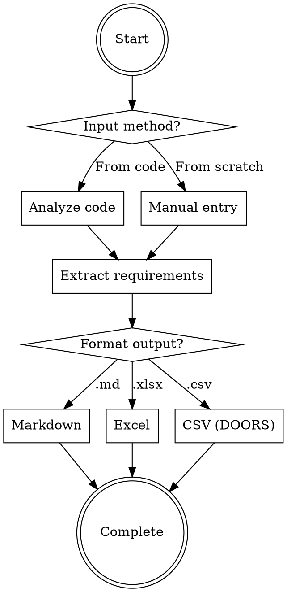
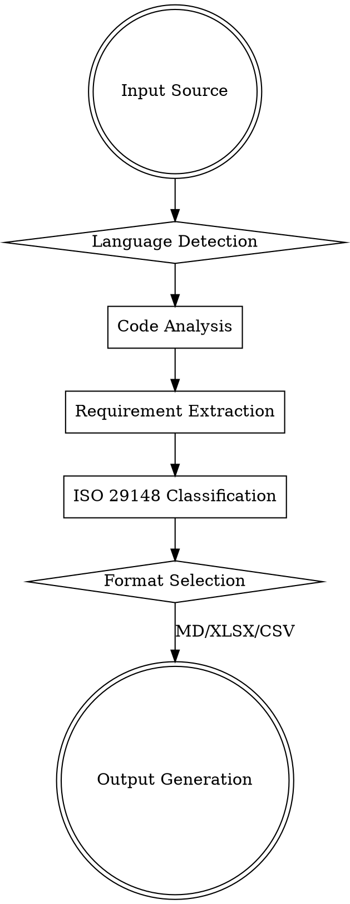
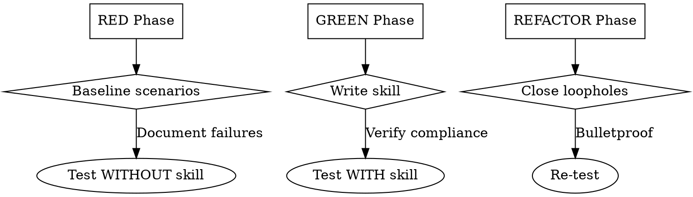

# Design: ISO 29148 Requirements Engineering Skill

## Overview

This skill provides bidirectional ISO/IEC/IEEE 29148:2018 compliant requirements engineering for technical teams. It supports:
- **Reverse engineering**: Extract requirements from existing code implementation
- **Forward engineering**: Create new requirements from scratch
- **Multi-format output**: Markdown (.md), Excel (.xlsx), and CSV (DOORS-compatible)

## Architecture

```
┌─────────────────────────────────────────────────────────────┐
│                   Requirements Skill                        │
├─────────────────────────────────────────────────────────────┤
│                                                             │
│  ┌──────────────────┐        ┌──────────────────┐         │
│  │   Input Methods  │        │   Output Formats │         │
│  ├──────────────────┤        ├──────────────────┤         │
│  │ 1. Code Analysis │        │ • Markdown (.md) │         │
│  │ 2. Manual Entry │        │ • Excel (.xlsx)  │         │
│  └──────────────────┘        │ • CSV (DOORS)    │         │
│                              └──────────────────┘         │
└─────────────────────────────────────────────────────────────┘
```

## Core Requirements Structure (ISO 29148)

Following ISO 29148 sections:
- **Functional Requirements**: What the system shall do
- **Non-Functional Requirements**: Quality attributes (performance, security, reliability)
- **Interface Requirements**: External interfaces (APIs, UI, hardware)
- **Data Requirements**: Data structures, storage, validation
- **Verification Criteria**: How to verify each requirement

## Core Workflow



## DOORS CSV Format Specification

DOORS import requires specific column structure:

| Column | Description | Required |
|--------|-------------|----------|
| `ID` | Unique requirement identifier (e.g., REQ-001) | ✅ |
| `Text` | Full requirement description | ✅ |
| `Type` | Requirement category (Functional/Non-Functional/etc.) | ✅ |
| `Priority` | Priority level (Critical/High/Medium/Low) | ✅ |
| `Status` | Status (Draft/Approved/Implemented) | ✅ |
| `Verification` | Verification criteria | ✅ |
| `Parent_ID` | Parent requirement ID (for hierarchy) | ❌ |
| `Source` | Source (code file path or manual) | ❌ |
| `Rationale` | Business rationale | ❌ |

## Implementation Approach

**Pure Claude (Recommended)**

- Claude analyzes code structure across languages (Python, JS/TS, Go, Java, C/C++)
- Language-agnostic semantic analysis
- Outputs via LLM reasoning
- **Pros**: Flexible, handles all languages, no external dependencies
- **Cons**: Token-intensive for large codebases

## Data Flow



**Code Analysis by Language:**
- **Python**: Functions, classes, decorators, type hints
- **JavaScript/TypeScript**: Classes, interfaces, types, exports
- **Go**: Functions, structs, interfaces, packages
- **Java**: Classes, interfaces, annotations, packages
- **C/C++**: Functions, structs, classes, headers

## Error Handling

| Error Type | Handling Strategy |
|------------|-------------------|
| Large codebase | Process in batches, ask user for scope |
| Ambiguous requirements | Ask clarifying questions |
| Missing context | Request related files/docs |
| Output generation failure | Retry with alternative format |

## Testing Strategy



**Test Scenarios:**
- **RED Phase**: Run pressure scenarios WITHOUT skill, document baseline behavior and rationalizations
- **GREEN Phase**: Write minimal skill, verify agents comply
- **REFACTOR Phase**: Identify new rationalizations, add counters, re-test

**Pressure Types for Testing:**
- Time pressure ("I need this quickly")
- Sunk cost ("I already analyzed it manually")
- Authority ("Just summarize what the code does")
- Exhaustion (multiple iterations)

**Test Code Samples:**
- Simple function (Python)
- Class with methods (TypeScript)
- Struct with interfaces (Go)
- Complex inheritance (Java)

## Supporting Files

```
iso-requirements/
  SKILL.md                    # Main reference (required)
  doors-csv-template.csv      # DOORS import template (reference)
```

**DOORS CSV Template:**
- Column headers matching DOORS import specification
- Example rows showing proper formatting
- UTF-8 encoded for international characters

## Skill Metadata (Frontmatter)

```yaml
---
name: iso-requirements
description: Use when generating ISO/IEC/IEEE 29148:2018 compliant software requirements from code implementation or creating new requirements from scratch. Supports reverse engineering (code to requirements) and forward engineering (manual entry) workflows. Outputs to Markdown, Excel, or DOORS-compatible CSV. Handles multiple languages: Python, JavaScript/TypeScript, Go, Java, C/C++. Triggered when user mentions requirements specification, ISO standards, DOORS import, or need to document what code implements.
---
```