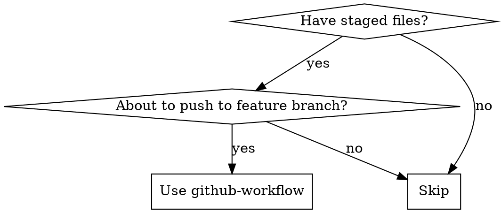

# GitHub Workflow

## Overview

Complete preparation workflow before pushing staged files to a feature branch, covering quality checks, issue creation, branch setup, and commit formatting.

## When to Use



**Use when:**
- Staged files ready for push
- Creating feature branch for work
- Ensuring quality before pushing

**NOT for:**
- Quick commits to main branch
- Work without quality gates
- Pushing to gitee (GitHub only)

## Workflow Steps

### 1. Quality Gates (All Must Pass)

```bash
# Run all checks
ruff check src/ tools/
mypy src/
pytest
pip install -e .
```

**Requirements:**
- Ruff: No linting errors
- MyPy: No type errors
- Pytest: All tests pass
- Package installs successfully

**Display summary:**
```
Check        Status    Details
─────────────────────────────────
Ruff         ✅ Pass    No linting errors
MyPy         ✅ Pass    No type errors
Pytest       ✅ Pass    All tests passed
Install      ✅ Pass    Package installed
```

**If any fail:**
- Report errors
- Ask user: abort, fix & retry, or continue
- Don't proceed without confirmation

### 2. Analyze Changes

```bash
git status
git diff
```

Get brief summary from user if diff unclear.

### 3. Create GitHub Issue

```bash
gh issue create \
  --title "<type>: <brief description>" \
  --body "$(cat <<'EOF'
## Summary

## Changes

## Files Modified

## Test Coverage

## Requirements
EOF
)"
```

- Capture issue number (e.g., #20)
- Types: feat, fix, docs, refactor, test, chore

### 4. Create Feature Branch

```bash
git checkout -b feature/<requirement-id>-short-description
# or
git checkout -b feature/<type>-short-description
```

Examples:
- `feature/swr-writer-00006-class-file-structure`
- `feature/add-new-parser`

### 5. Stage and Commit

```bash
git add <relevant-files>
git commit -m "$(cat <<'EOF'
<type>: <description>

<detailed description of changes>

Closes #<issue-number>
EOF
)"
```

**Commit types:**
- `feat`: New feature
- `fix`: Bug fix
- `docs`: Documentation changes
- `style`: Code style changes
- `refactor`: Code refactoring
- `test`: Adding or updating tests
- `chore`: Maintenance tasks

**IMPORTANT:** No Co-Authored-By line

## Quick Reference

| Step | Command | Required |
|------|---------|----------|
| Lint | `ruff check src/ tools/` | ✅ |
| Type check | `mypy src/` | ✅ |
| Test | `pytest` | ✅ |
| Install | `pip install -e .` | ✅ |
| Issue | `gh issue create` | ✅ |
| Branch | `git checkout -b feature/*` | ✅ |
| Commit | `git commit` | ✅ |

## Common Mistakes

| Mistake | Fix |
|---------|-----|
| Pushing without tests | Run pytest first |
| Missing issue reference | Add `Closes #N` to commit |
| Using gitee remote | Push to GitHub only |
| Adding Co-Authored-By | Remove Claude attribution |

## Red Flags - STOP

- [ ] Quality checks failed
- [ ] No GitHub issue created
- [ ] Commit message doesn't follow format
- [ ] Commit message includes Co-Authored-By line
- [ ] Branch name doesn't follow `feature/<type>-*` or `feature/<requirement-id>-*` convention
- [ ] Commit message missing `Closes #<issue-number>` reference
- [ ] About to push to gitee

**Any red flag? Fix before proceeding.**

## Related

- Push to GitHub: Use `git push` (manual step after this workflow)
- Full automation: `/gh-workflow` (includes PR creation)