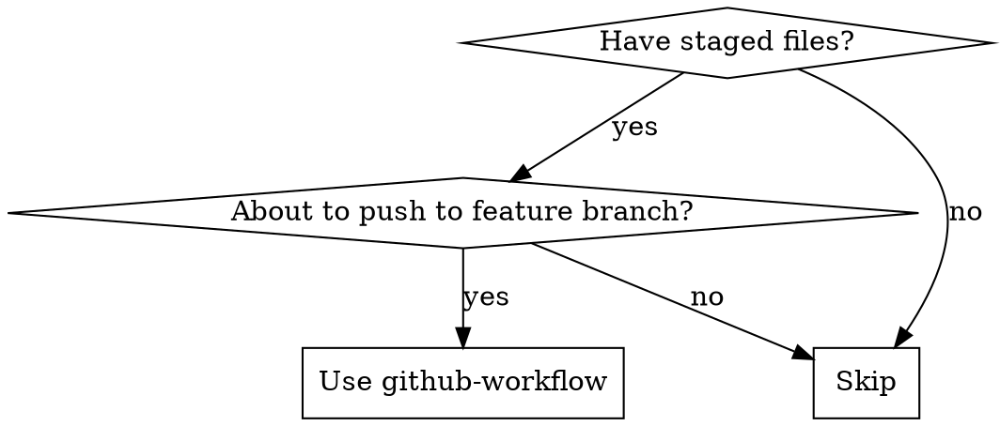

# GitHub Workflow

## Overview

Complete preparation workflow before pushing staged files to a feature branch, covering quality checks, issue creation, branch setup, and commit formatting. Supports multiple project types with auto-detection.

## When to Use



**Use when:**
- Staged files ready for push
- Creating feature branch for work
- Ensuring quality before pushing
- Any project type (Python, JS/TS, Go, Java, C/C++)

**NOT for:**
- Quick commits to main branch
- Work without quality gates
- Pushing to gitee (GitHub only)

## Auto-Detect Project Type

Check for these files to determine project type (check in order):

| Language | Detection Files |
|----------|-----------------|
| Python | `pyproject.toml`, `requirements.txt`, `setup.py` |
| JavaScript/TypeScript | `package.json`, `tsconfig.json` |
| Go | `go.mod` |
| Java | `pom.xml`, `build.gradle`, `build.gradle.kts` |
| C/C++ | `CMakeLists.txt`, `Makefile` |

**If no files match**: Ask user to specify project type.

## Workflow Steps

### 1. Auto-Detect Project Type

Run detection checks in order:

```bash
# Check for Python
ls pyproject.toml requirements.txt setup.py 2>/dev/null | head -1 && echo "python" || \
# Check for JS/TS
ls package.json tsconfig.json 2>/dev/null | head -1 && echo "js" || \
# Check for Go
ls go.mod 2>/dev/null | head -1 && echo "go" || \
# Check for Java
ls pom.xml build.gradle build.gradle.kts 2>/dev/null | head -1 && echo "java" || \
# Check for C/C++
ls CMakeLists.txt Makefile 2>/dev/null | head -1 && echo "cpp" || \
echo "unknown"
```

**If "unknown"**: Ask user to specify project type.

### 2. Quality Gates (All Must Pass)

#### Python (detected via pyproject.toml, requirements.txt, setup.py)

```bash
ruff check src/ tools/
mypy src/
pytest
pip install -e .
```

**Requirements:**
- Ruff: No linting errors
- MyPy: No type errors
- Pytest: All tests pass
- Package installs successfully

#### JavaScript/TypeScript (detected via package.json, tsconfig.json)

```bash
# Check package.json for available scripts
if grep -q "lint" package.json; then npm run lint; fi
if grep -q "format:check" package.json; then npm run format:check; fi
if grep -q "test" package.json; then npm test; fi

# Or fallback to common tools
npx eslint . --max-warnings 0 2>/dev/null || true
npx prettier --check . 2>/dev/null || true
npm test
```

**Requirements:**
- ESLint: No errors (max-warnings 0)
- Prettier: No formatting changes needed
- Tests: All tests pass

#### Go (detected via go.mod)

```bash
go fmt ./...
go vet ./...
go test ./... -v
go build ./...
```

**Requirements:**
- go fmt: No files need formatting
- go vet: No issues reported
- go test: All tests pass
- go build: Compiles successfully

#### Java (detected via pom.xml, build.gradle, build.gradle.kts)

**Maven:**
```bash
mvn checkstyle:check
mvn test
mvn package
```

**Gradle:**
```bash
./gradlew checkstyleMain
./gradlew test
./gradlew build
```

**Requirements:**
- Checkstyle: No violations
- Tests: All tests pass
- Build: Compiles successfully

#### C/C++ (detected via CMakeLists.txt, Makefile)

**CMake:**
```bash
cmake --build build --target all
ctest --test-dir build
clang-format --dry-run --Werror src/**/*.cpp 2>/dev/null || true
```

**Makefile:**
```bash
make check 2>/dev/null || make
make test 2>/dev/null || make check
clang-format --dry-run --Werror src/*.c src/*.cpp 2>/dev/null || true
```

**Requirements:**
- Build: Compiles successfully
- Tests: All tests pass (if tests exist)
- Format: No formatting changes needed

#### Display Summary Format

```
Check        Status    Details
─────────────────────────────────
Linting      ✅ Pass    No issues found
Formatting   ✅ Pass    No changes needed
Tests        ✅ Pass    All tests passed
Build        ✅ Pass    Build successful
```

**If any fail:**
- Report errors
- Ask user: abort, fix & retry, or continue
- Don't proceed without confirmation

### 3. Analyze Changes

```bash
git status
git diff
```

Get brief summary from user if diff unclear.

### 4. Create GitHub Issue

```bash
gh issue create \
  --title "<type>: <brief description>" \
  --body "$(cat <<'EOF'
## Summary

## Changes

## Files Modified

## Test Coverage

## Requirements
EOF
)"
```

- Capture issue number (e.g., #20)
- Types: feat, fix, docs, refactor, test, chore
- **Skip if issue already exists** - ask user for existing issue number

### 5. Create Feature Branch

```bash
git checkout -b feature/<requirement-id>-short-description
# or
git checkout -b feature/<type>-short-description
```

Examples:
- `feature/swr-writer-00006-class-file-structure`
- `feature/add-new-parser`

### 6. Stage and Commit

```bash
git add <relevant-files>
git commit -m "$(cat <<'EOF'
<type>: <description>

<detailed description of changes>

Closes #<issue-number>
EOF
)"
```

**Commit types:**
- `feat`: New feature
- `fix`: Bug fix
- `docs`: Documentation changes
- `style`: Code style changes
- `refactor`: Code refactoring
- `test`: Adding or updating tests
- `chore`: Maintenance tasks

**IMPORTANT:** No Co-Authored-By line

## Quick Reference

| Step | Action | Required |
|------|--------|----------|
| 1 | Detect project type | ✅ |
| 2 | Run language-specific quality gates | ✅ |
| 3 | Review changes (git diff) | ✅ |
| 4 | Create/Link GitHub issue | ✅ |
| 5 | Create feature branch | ✅ |
| 6 | Stage and commit | ✅ |

### Quality Gates by Language

| Language | Linting | Type Check | Tests | Build |
|----------|---------|------------|-------|-------|
| Python | ruff | mypy | pytest | pip install |
| JS/TS | eslint | n/a | npm test | n/a |
| Go | go vet | n/a | go test | go build |
| Java (Maven) | checkstyle | n/a | mvn test | mvn package |
| Java (Gradle) | checkstyle | n/a | gradle test | gradle build |
| C/C++ | clang-tidy | n/a | ctest/make test | cmake build |

## Common Mistakes

| Mistake | Fix |
|---------|-----|
| Pushing without tests | Run language-specific test command first |
| Missing issue reference | Add `Closes #N` to commit message |
| Using gitee remote | Push to GitHub only |
| Adding Co-Authored-By | Remove Claude attribution |
| Wrong quality gates for project type | Auto-detect and use language-specific commands |
| Not checking format before push | Run format check for your language |

## Red Flags - STOP

- [ ] Quality checks failed (any language)
- [ ] No GitHub issue created or linked
- [ ] Commit message doesn't follow format
- [ ] Commit message includes Co-Authored-By line
- [ ] Branch name doesn't follow `feature/<type>-*` or `feature/<requirement-id>-*` convention
- [ ] Commit message missing `Closes #<issue-number>` reference
- [ ] About to push to gitee
- [ ] Project type unknown and not specified by user
- [ ] Language-specific build commands not run

**Any red flag? Fix before proceeding.**

## Related

- Push to GitHub: Use `git push` (manual step after this workflow)
- Full automation: `/gh-workflow` (includes PR creation)
- Language-specific docs: See project-specific sections above for detailed commands

## Supported Project Types Summary

| Language | Config Files Detected | Quality Gates |
|----------|----------------------|---------------|
| Python | pyproject.toml, requirements.txt, setup.py | ruff, mypy, pytest, pip install |
| JavaScript/TypeScript | package.json, tsconfig.json | eslint, prettier, npm test |
| Go | go.mod | go fmt, go vet, go test, go build |
| Java (Maven) | pom.xml | checkstyle, mvn test, mvn package |
| Java (Gradle) | build.gradle, build.gradle.kts | checkstyle, gradle test, gradle build |
| C/C++ | CMakeLists.txt, Makefile | clang-format, ctest/make test, cmake build |