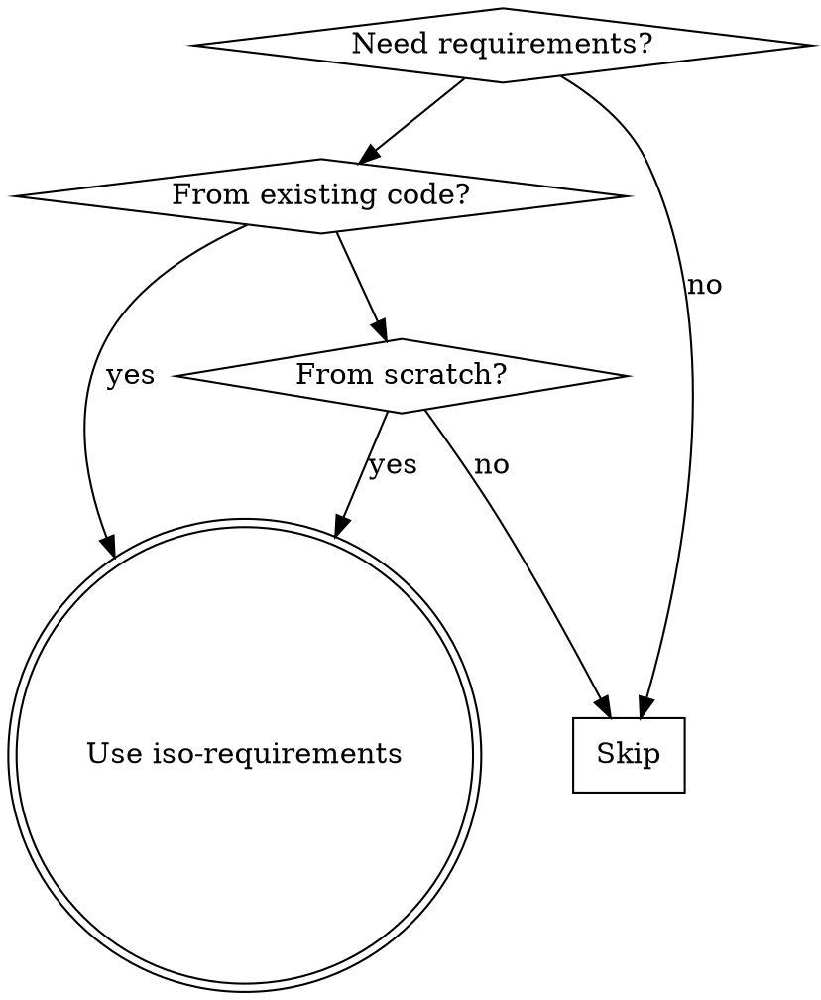
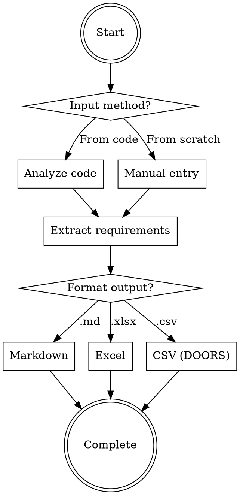

# ISO 29148 Requirements Engineering

## Overview

Generate ISO/IEC/IEEE 29148:2018 compliant software requirements through bidirectional workflows:
- **Reverse engineering**: Extract requirements from existing code implementation
- **Forward engineering**: Create new requirements from scratch
- **Multi-format output**: Markdown (.md), Excel (.xlsx), DOORS-compatible CSV

Core principle: Transform code semantics or user intent into structured requirements following ISO 29148 standard sections.

## When to Use



**Use when:**
- User mentions "requirements specification" or "ISO standards"
- Need to document what code implements (reverse engineering)
- Creating new requirements from user stories (forward engineering)
- Need DOORS import format for requirement management tools
- Any language: Python, JavaScript/TypeScript, Go, Java, C/C++

**NOT for:**
- Simple code summaries without ISO structure
- Non-technical documentation
- Requirements outside software engineering scope

## Core Workflow



**Critical flow:** Always determine input method first, then extract requirements, finally format output. Do not skip classification or verification steps.

## ISO 29148 Requirements Structure

Following ISO/IEC/IEEE 29148:2018 standard sections:

| Section | Description | Example |
|---------|-------------|---------|
| **Functional Requirements** | What the system shall do | "System shall authenticate users via LDAP" |
| **Non-Functional Requirements** | Quality attributes | "API response time < 200ms" |
| **Interface Requirements** | External interfaces | "REST API with JSON responses" |
| **Data Requirements** | Data structures, storage, validation | "User data stored in PostgreSQL" |
| **Verification Criteria** | How to verify each requirement | "Verify LDAP login succeeds with valid credentials" |

**Requirement Types:**
- Functional: System behavior, features
- Non-Functional: Performance, security, reliability, usability
- Interface: APIs, UI, hardware integration
- Data: Data models, storage, validation rules

## Reverse Engineering: Code to Requirements

Extract requirements from existing code implementation by analyzing code structure and semantics.

### Language-Specific Analysis Patterns

**Python:**
- Functions → Functional requirements
- Classes and methods → System behavior
- Decorators (e.g., `@app.route`) → Interface requirements
- Type hints → Data requirements
- Exception handling → Error behavior requirements

**JavaScript/TypeScript:**
- Functions → Functional requirements
- Classes and interfaces → System structure
- Type definitions → Data requirements
- Export statements → Module interface requirements
- Async/await → Concurrency requirements

**Go:**
- Functions → Functional requirements
- Structs and interfaces → Data and interface requirements
- Packages → Module organization
- Error handling patterns → Error behavior requirements
- Go tags → Validation requirements

**Java:**
- Classes and methods → Functional requirements
- Interfaces → Contract requirements
- Annotations → Metadata and validation
- Exception classes → Error handling requirements
- Packages → Module structure

**C/C++:**
- Functions → Functional requirements
- Structs and classes → Data requirements
- Header files → Interface requirements
- Preprocessor directives → Conditional compilation requirements

### Process

1. **Detect language** from file extensions (.py, .js, .ts, .go, .java, .c, .cpp, .h)
2. **Analyze code structure**: identify functions, classes, interfaces
3. **Extract semantics**: understand what code does, not just syntax
4. **Classify by ISO 29148 sections**: map code patterns to requirement types
5. **Generate verification criteria**: define how to verify each requirement

### Example

Input code (Python):
```python
def authenticate_user(username: str, password: str) -> bool:
    """Authenticate user against LDAP server."""
    # LDAP authentication logic
    return True
```

Output requirement:
- ID: REQ-001
- Type: Functional
- Text: System shall authenticate users against LDAP server using username and password
- Verification: Verify successful authentication with valid LDAP credentials
- Source: src/auth.py:authenticate_user

## Forward Engineering: Manual Entry

Create new requirements from scratch based on user stories, business requirements, or stakeholder input.

### Process

1. **Gather inputs**: user stories, business requirements, stakeholder requests
2. **Identify scope**: define system boundaries and constraints
3. **Extract requirements**: translate business language to technical requirements
4. **Classify by ISO 29148 sections**: categorize each requirement
5. **Define verification criteria**: specify acceptance criteria
6. **Assign metadata**: priority, status, rationale

### Guiding Questions

Ask users these questions to elicit complete requirements:

- **Functional**: What should the system do? What are the core features?
- **Non-Functional**: What are performance targets? Security requirements? Reliability needs?
- **Interface**: Does the system integrate with external systems? What are the APIs?
- **Data**: What data needs to be stored? How should it be validated?
- **Verification**: How will we know this requirement is met?

### Example

Input: "Users need to log in quickly and securely"

Elaborated requirements:
- REQ-001 (Functional): System shall support user authentication with username and password
- REQ-002 (Non-Functional): Authentication response time shall be less than 2 seconds under normal load
- REQ-003 (Non-Functional): Passwords shall be hashed using bcrypt with minimum 12 rounds
- REQ-004 (Functional): System shall lock account after 5 failed login attempts

## Output Formats

Choose output format based on user needs and downstream tooling.

### Markdown (.md)

**Use when:** Human-readable documentation, version control, code review

**Structure:**
```markdown
# Software Requirements Specification

## Functional Requirements

### REQ-001: User Authentication
**Type:** Functional
**Priority:** Critical
**Status:** Draft

**Description:** System shall authenticate users via username and password.

**Verification:** Verify login succeeds with valid credentials.

**Source:** src/auth/login.py

---

## Non-Functional Requirements

### REQ-002: Authentication Performance
**Type:** Non-Functional
**Priority:** High
**Status:** Draft

**Description:** Authentication response time shall be less than 2 seconds.

**Verification:** Measure API response time under normal load.
```

### Excel (.xlsx)

**Use when:** Stakeholder reviews, business analysis, offline editing

**Structure:** Table format with one row per requirement
- Column A: ID
- Column B: Text
- Column C: Type
- Column D: Priority
- Column E: Status
- Column F: Verification
- Column G: Parent_ID
- Column H: Source
- Column I: Rationale

### CSV (DOORS-compatible)

**Use when:** Importing to DOORS or other requirements management tools

**Structure:** See `doors-csv-template.csv` for reference

**Required columns:** ID, Text, Type, Priority, Status, Verification
**Optional columns:** Parent_ID, Source, Rationale

**Encoding:** UTF-8 for international character support

**CSV format rules:**
- Use double quotes for fields containing commas or newlines
- Escape double quotes with two double quotes ("")
- No trailing spaces in fields
- Unix line endings (\n)

Example line:
```csv
REQ-001,"System shall authenticate users via username and password",Functional,Critical,Draft,"Verify login with valid credentials",,src/auth.py,"Security"
```

## DOORS CSV Format Specification

DOORS (Dynamic Object Oriented Requirements System) import requires specific CSV structure.

### Required Columns

| Column | Format | Example |
|--------|--------|---------|
| `ID` | REQ-### format | REQ-001 |
| `Text` | Full requirement description | "System shall authenticate users" |
| `Type` | Functional/Non-Functional/Interface/Data | Functional |
| `Priority` | Critical/High/Medium/Low | Critical |
| `Status` | Draft/Approved/Implemented/Rejected | Draft |
| `Verification` | Acceptance criteria | "Verify login with valid credentials" |

### Optional Columns

| Column | Format | Example |
|--------|--------|---------|
| `Parent_ID` | Parent requirement ID for hierarchy | REQ-001 |
| `Source` | Code file path or "manual" | src/auth/login.py |
| `Rationale` | Business justification | "Security requirement" |

### Reference Template

See `doors-csv-template.csv` for complete example with proper formatting.

### Import Instructions

1. Generate CSV using specified columns
2. Ensure UTF-8 encoding
3. Import into DOORS using File → Import → CSV
4. Map columns to DOORS attributes
5. Verify imported requirements match expectations
