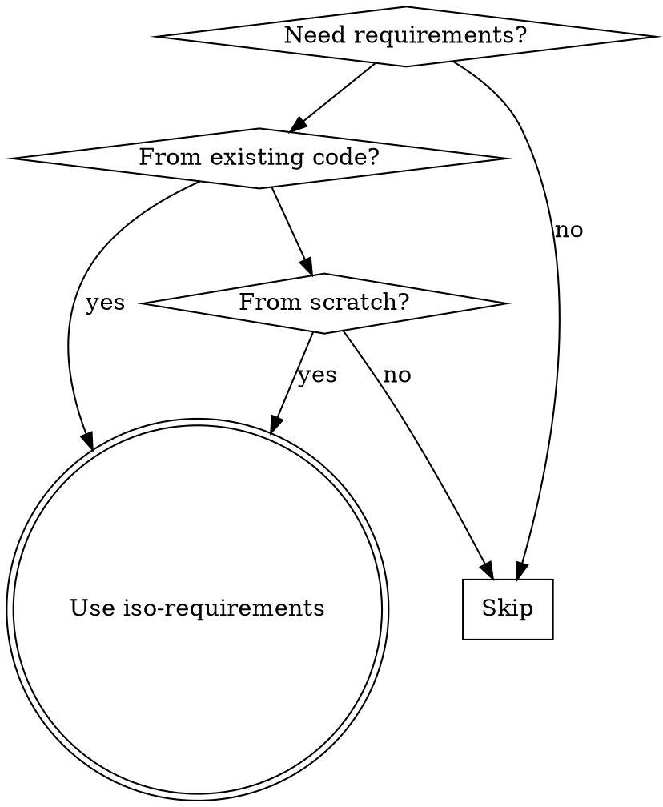

# ISO 29148 Requirements Engineering

## Overview

Generate ISO/IEC/IEEE 29148:2018 compliant software requirements through bidirectional workflows:
- **Reverse engineering**: Extract requirements from existing code implementation
- **Forward engineering**: Create new requirements from scratch
- **Multi-format output**: Markdown (.md), Excel (.xlsx), DOORS-compatible CSV

Core principle: Transform code semantics or user intent into structured requirements following ISO 29148 standard sections.

## When to Use

**Use when:**
- User mentions "requirements specification" or "ISO standards"
- Need to document what code implements (reverse engineering)
- Creating new requirements from user stories (forward engineering)
- Need DOORS import format for requirement management tools
- Any language: Python, JavaScript/TypeScript, Go, Java, C/C++

**NOT for:**
- Simple code summaries without ISO structure
- Non-technical documentation
- Requirements outside software engineering scope
