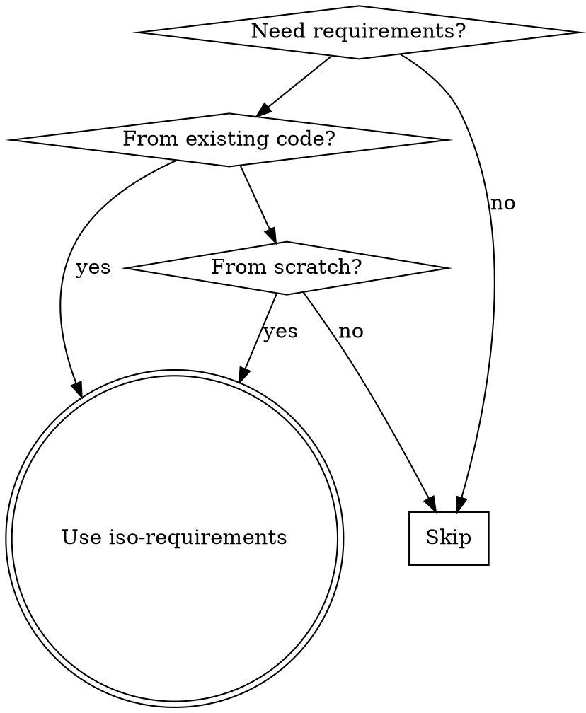
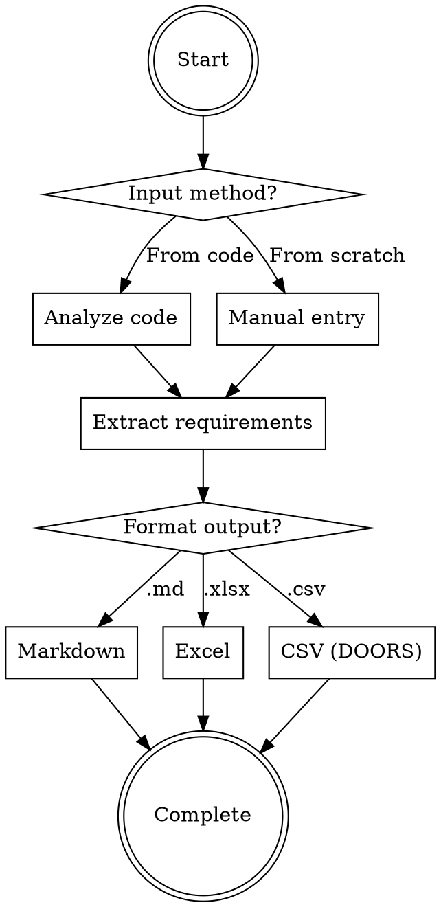

# ISO 29148 Requirements Engineering

## Overview

Generate ISO/IEC/IEEE 29148:2018 compliant software requirements through bidirectional workflows:
- **Reverse engineering**: Extract requirements from existing code implementation
- **Forward engineering**: Create new requirements from scratch
- **Multi-format output**: Markdown (.md), Excel (.xlsx), DOORS-compatible CSV

Core principle: Transform code semantics or user intent into structured requirements following ISO 29148 standard sections.

## When to Use



**Use when:**
- User mentions "requirements specification" or "ISO standards"
- Need to document what code implements (reverse engineering)
- Creating new requirements from user stories (forward engineering)
- Need DOORS import format for requirement management tools
- Any language: Python, JavaScript/TypeScript, Go, Java, C/C++

**NOT for:**
- Simple code summaries without ISO structure
- Non-technical documentation
- Requirements outside software engineering scope

## Core Workflow



**Critical flow:** Always determine input method first, then extract requirements, finally format output. Do not skip classification or verification steps.

## ISO 29148 Requirements Structure

Following ISO/IEC/IEEE 29148:2018 standard sections:

| Section | Description | Example |
|---------|-------------|---------|
| **Functional Requirements** | What the system shall do | "System shall authenticate users via LDAP" |
| **Non-Functional Requirements** | Quality attributes | "API response time < 200ms" |
| **Interface Requirements** | External interfaces | "REST API with JSON responses" |
| **Data Requirements** | Data structures, storage, validation | "User data stored in PostgreSQL" |
| **Verification Criteria** | How to verify each requirement | "Verify LDAP login succeeds with valid credentials" |

**Requirement Types:**
- Functional: System behavior, features
- Non-Functional: Performance, security, reliability, usability
- Interface: APIs, UI, hardware integration
- Data: Data models, storage, validation rules

## Reverse Engineering: Code to Requirements

Extract requirements from existing code implementation by analyzing code structure and semantics.

### Language-Specific Analysis Patterns

**Python:**
- Functions → Functional requirements
- Classes and methods → System behavior
- Decorators (e.g., `@app.route`) → Interface requirements
- Type hints → Data requirements
- Exception handling → Error behavior requirements

**JavaScript/TypeScript:**
- Functions → Functional requirements
- Classes and interfaces → System structure
- Type definitions → Data requirements
- Export statements → Module interface requirements
- Async/await → Concurrency requirements

**Go:**
- Functions → Functional requirements
- Structs and interfaces → Data and interface requirements
- Packages → Module organization
- Error handling patterns → Error behavior requirements
- Go tags → Validation requirements

**Java:**
- Classes and methods → Functional requirements
- Interfaces → Contract requirements
- Annotations → Metadata and validation
- Exception classes → Error handling requirements
- Packages → Module structure

**C/C++:**
- Functions → Functional requirements
- Structs and classes → Data requirements
- Header files → Interface requirements
- Preprocessor directives → Conditional compilation requirements

### Process

1. **Detect language** from file extensions (.py, .js, .ts, .go, .java, .c, .cpp, .h)
2. **Analyze code structure**: identify functions, classes, interfaces
3. **Extract semantics**: understand what code does, not just syntax
4. **Classify by ISO 29148 sections**: map code patterns to requirement types
5. **Generate verification criteria**: define how to verify each requirement

### Example

Input code (Python):
```python
def authenticate_user(username: str, password: str) -> bool:
    """Authenticate user against LDAP server."""
    # LDAP authentication logic
    return True
```

Output requirement:
- ID: REQ-001
- Type: Functional
- Text: System shall authenticate users against LDAP server using username and password
- Verification: Verify successful authentication with valid LDAP credentials
- Source: src/auth.py:authenticate_user

## Forward Engineering: Manual Entry

Create new requirements from scratch based on user stories, business requirements, or stakeholder input.

### Process

1. **Gather inputs**: user stories, business requirements, stakeholder requests
2. **Identify scope**: define system boundaries and constraints
3. **Extract requirements**: translate business language to technical requirements
4. **Classify by ISO 29148 sections**: categorize each requirement
5. **Define verification criteria**: specify acceptance criteria
6. **Assign metadata**: priority, status, rationale

### Guiding Questions

Ask users these questions to elicit complete requirements:

- **Functional**: What should the system do? What are the core features?
- **Non-Functional**: What are performance targets? Security requirements? Reliability needs?
- **Interface**: Does the system integrate with external systems? What are the APIs?
- **Data**: What data needs to be stored? How should it be validated?
- **Verification**: How will we know this requirement is met?

### Example

Input: "Users need to log in quickly and securely"

Elaborated requirements:
- REQ-001 (Functional): System shall support user authentication with username and password
- REQ-002 (Non-Functional): Authentication response time shall be less than 2 seconds under normal load
- REQ-003 (Non-Functional): Passwords shall be hashed using bcrypt with minimum 12 rounds
- REQ-004 (Functional): System shall lock account after 5 failed login attempts

## Output Formats

Choose output format based on user needs and downstream tooling.

### Markdown (.md)

**Use when:** Human-readable documentation, version control, code review

**Structure:**
```markdown
# Software Requirements Specification

## Functional Requirements

### REQ-001: User Authentication
**Type:** Functional
**Priority:** Critical
**Status:** Draft

**Description:** System shall authenticate users via username and password.

**Verification:** Verify login succeeds with valid credentials.

**Source:** src/auth/login.py

---

## Non-Functional Requirements

### REQ-002: Authentication Performance
**Type:** Non-Functional
**Priority:** High
**Status:** Draft

**Description:** Authentication response time shall be less than 2 seconds.

**Verification:** Measure API response time under normal load.
```

### Excel (.xlsx)

**Use when:** Stakeholder reviews, business analysis, offline editing

**Structure:** Table format with one row per requirement
- Column A: ID
- Column B: Text
- Column C: Type
- Column D: Priority
- Column E: Status
- Column F: Verification
- Column G: Parent_ID
- Column H: Source
- Column I: Rationale

### CSV (DOORS-compatible)

**Use when:** Importing to DOORS or other requirements management tools

**Structure:** See `doors-csv-template.csv` for reference

**Required columns:** ID, Text, Type, Priority, Status, Verification
**Optional columns:** Parent_ID, Source, Rationale

**Encoding:** UTF-8 for international character support

**CSV format rules:**
- Use double quotes for fields containing commas or newlines
- Escape double quotes with two double quotes ("")
- No trailing spaces in fields
- Unix line endings (\n)

Example line:
```csv
REQ-001,"System shall authenticate users via username and password",Functional,Critical,Draft,"Verify login with valid credentials",,src/auth.py,"Security"
```

## DOORS CSV Format Specification

DOORS (Dynamic Object Oriented Requirements System) import requires specific CSV structure.

### Required Columns

| Column | Format | Example |
|--------|--------|---------|
| `ID` | REQ-### format | REQ-001 |
| `Text` | Full requirement description | "System shall authenticate users" |
| `Type` | Functional/Non-Functional/Interface/Data | Functional |
| `Priority` | Critical/High/Medium/Low | Critical |
| `Status` | Draft/Approved/Implemented/Rejected | Draft |
| `Verification` | Acceptance criteria | "Verify login with valid credentials" |

### Optional Columns

| Column | Format | Example |
|--------|--------|---------|
| `Parent_ID` | Parent requirement ID for hierarchy | REQ-001 |
| `Source` | Code file path or "manual" | src/auth/login.py |
| `Rationale` | Business justification | "Security requirement" |

### Reference Template

See `doors-csv-template.csv` for complete example with proper formatting.

### Import Instructions

1. Generate CSV using specified columns
2. Ensure UTF-8 encoding
3. Import into DOORS using File → Import → CSV
4. Map columns to DOORS attributes
5. Verify imported requirements match expectations

## Quick Reference

### Workflow Steps

| Step | Action | Input | Output |
|------|--------|-------|--------|
| 1 | Determine input method | Code file or user intent | Reverse or forward engineering |
| 2 | Analyze code or gather requirements | Code/business input | Requirement semantics |
| 3 | Extract requirements | Analysis results | Requirement list |
| 4 | Classify by ISO 29148 sections | Requirement list | Categorized requirements |
| 5 | Generate verification criteria | Requirements | Acceptance tests |
| 6 | Format output | Requirements + metadata | .md/.xlsx/.csv file |

### Language Detection

| File Extension | Language | Analysis Patterns |
|----------------|----------|-------------------|
| .py | Python | Functions, classes, decorators, type hints |
| .js, .ts | JavaScript/TypeScript | Functions, classes, interfaces, types |
| .go | Go | Functions, structs, interfaces, packages |
| .java | Java | Classes, methods, interfaces, annotations |
| .c, .cpp, .h | C/C++ | Functions, structs, classes, headers |

### Priority Levels

| Priority | Definition | Use When |
|----------|------------|----------|
| Critical | System failure without this feature | Security, core functionality |
| High | Significant impact if not met | Performance, reliability |
| Medium | Important but workarounds exist | UX, convenience features |
| Low | Nice to have | Future enhancements |

### Status Values

| Status | Definition | Next Step |
|--------|------------|-----------|
| Draft | Initial requirement written | Review and refine |
| Approved | Stakeholder approved | Implement |
| Implemented | Code satisfies requirement | Verify and test |
| Rejected | Requirement no longer needed | Archive |

## Common Mistakes

| Mistake | Fix |
|---------|-----|
| Writing implementation details instead of requirements | Focus on WHAT, not HOW. Use "System shall" language |
| Missing verification criteria | Always include "Verification:" field for each requirement |
| Using vague language | Use specific, measurable terms (e.g., "< 200ms" not "fast") |
| Confusing functional and non-functional requirements | Functional = behavior, Non-Functional = quality attributes |
| Forgetting source attribution | Always track where each requirement originated |
| Inconsistent ID format | Use REQ-### format consistently throughout |
| Missing priority levels | Assign priority to every requirement (Critical/High/Medium/Low) |
| Ignoring language-specific patterns | Apply language-specific analysis (decorators, annotations, etc.) |
| Generating requirements without user intent | Verify requirements align with stakeholder needs |
| Using wrong CSV format for DOORS | Follow exact column structure and encoding rules |
| Skipping verification step | Always define acceptance criteria for testing |
| Writing requirements as questions | State requirements as declarations using "shall" |
| Including multiple requirements in one item | Split complex requirements into individual items |
| Not handling error cases | Include error behavior requirements explicitly |
| Ignoring internationalization | Use UTF-8 encoding for multi-language support |

## Red Flags - STOP

Before proceeding with requirements generation, verify:

- [ ] No "System should" language - must use "shall" per ISO 29148
- [ ] Every requirement has verification criteria
- [ ] Requirements are WHAT, not HOW (no implementation details)
- [ ] Each requirement has unique ID in REQ-### format
- [ ] All requirements have priority assigned
- [ ] Source attribution tracked for reverse-engineered requirements
- [ ] Language-specific patterns applied correctly
- [ ] CSV format matches DOORS specification (if using CSV)
- [ ] UTF-8 encoding set for international characters
- [ ] No vague terms (fast, good, adequate) - use measurable metrics

**Any red flag? Fix before proceeding.**

## Error Handling

| Error Type | Handling Strategy |
|------------|-------------------|
| Large codebase | Ask user to specify scope (files, directories, modules) |
| Ambiguous requirements | Ask clarifying questions to disambiguate |
| Missing context | Request related files, documentation, or user input |
| Unknown language | Ask user to specify language or provide guidance |
| Output generation failure | Retry with alternative format, ask user for preference |
| DOORS import issues | Verify CSV format, encoding, column structure |
| File not found | Check file path, ask user to verify location |
| Unreadable code | Ask for clarification, simplified description |

### Handling Large Codebases

When codebase is too large:
1. Ask user: "Which files/directories should I analyze?"
2. Offer scope options: specific files, modules, or full scan
3. Process in batches if needed
4. Provide progress updates for large analyses

## Complete Example

### Input Code: Authentication Module

```python
# src/auth.py
import ldap3
import time
from typing import Optional
import logging

logger = logging.getLogger(__name__)

class AuthenticationError(Exception):
    """Custom exception for authentication failures."""
    pass

class AccountLockedError(AuthenticationError):
    """Exception raised when account is locked."""
    pass

class AuthenticationService:
    """Handle user authentication with LDAP and local database."""

    MAX_ATTEMPTS = 5
    LOCKOUT_DURATION = 300  # seconds

    def __init__(self, ldap_server: str, ldap_base_dn: str):
        self.ldap_server = ldap_server
        self.ldap_base_dn = ldap_base_dn
        self._attempts_cache = {}

    def authenticate(self, username: str, password: str) -> bool:
        """
        Authenticate user against LDAP server.

        Args:
            username: User's LDAP username
            password: User's password

        Returns:
            True if authentication succeeds, False otherwise

        Raises:
            AccountLockedError: If account is locked due to failed attempts
            AuthenticationError: If LDAP server is unreachable
        """
        # Check if account is locked
        if self._is_locked(username):
            raise AccountLockedError(
                f"Account {username} is locked. Try again in {self._lockout_remaining(username)} seconds."
            )

        # Attempt LDAP authentication
        try:
            server = ldap3.Server(self.ldap_server)
            connection = ldap3.Connection(
                server,
                user=f"uid={username},{self.ldap_base_dn}",
                password=password,
                auto_bind=True
            )
            connection.unbind()

            # Clear failed attempts on successful auth
            self._clear_attempts(username)
            logger.info(f"User {username} authenticated successfully")
            return True

        except ldap3.core.exceptions.LDAPException as e:
            self._record_failed_attempt(username)
            logger.warning(f"Authentication failed for {username}: {e}")
            raise AuthenticationError(f"LDAP authentication failed: {e}")

    def _is_locked(self, username: str) -> bool:
        """Check if user account is currently locked."""
        if username not in self._attempts_cache:
            return False

        attempts, timestamp = self._attempts_cache[username]
        if attempts >= self.MAX_ATTEMPTS:
            elapsed = time.time() - timestamp
            if elapsed < self.LOCKOUT_DURATION:
                return True
            else:
                # Lockout expired, clear cache
                del self._attempts_cache[username]
        return False

    def _lockout_remaining(self, username: str) -> int:
        """Calculate remaining lockout time in seconds."""
        attempts, timestamp = self._attempts_cache.get(username, (0, 0))
        elapsed = time.time() - timestamp
        return max(0, self.LOCKOUT_DURATION - int(elapsed))

    def _record_failed_attempt(self, username: str):
        """Record a failed authentication attempt."""
        if username in self._attempts_cache:
            attempts, _ = self._attempts_cache[username]
            self._attempts_cache[username] = (attempts + 1, time.time())
        else:
            self._attempts_cache[username] = (1, time.time())

    def _clear_attempts(self, username: str):
        """Clear failed attempts after successful authentication."""
        if username in self._attempts_cache:
            del self._attempts_cache[username]
```

### Extracted Requirements

## Functional Requirements

### REQ-001: User Authentication
**Type:** Functional
**Priority:** Critical
**Status:** Draft

**Description:** System shall authenticate users against LDAP server using username and password credentials.

**Verification:** Verify successful authentication with valid LDAP credentials returns True, invalid credentials raise AuthenticationError.

**Source:** src/auth.py:AuthenticationService.authenticate

---

### REQ-002: Account Lockout
**Type:** Functional
**Priority:** High
**Status:** Draft

**Description:** System shall lock user accounts after 5 consecutive failed authentication attempts.

**Verification:** Trigger 5 failed attempts, verify 6th attempt raises AccountLockedError.

**Source:** src/auth.py:MAX_ATTEMPTS, _record_failed_attempt

---

### REQ-003: Lockout Duration
**Type:** Functional
**Priority:** Medium
**Status:** Draft

**Description:** System shall maintain account lockout for 300 seconds (5 minutes) after reaching maximum failed attempts.

**Verification:** After lockout, verify account unlocks after 300 seconds.

**Source:** src/auth.py:LOCKOUT_DURATION, _is_locked

---

### REQ-004: Attempt Clearing
**Type:** Functional
**Priority:** Medium
**Status:** Draft

**Description:** System shall clear failed authentication attempts after successful authentication.

**Verification:** Authenticate successfully, verify attempts counter is reset to zero.

**Source:** src/auth.py:_clear_attempts

---

## Non-Functional Requirements

### REQ-005: Authentication Performance
**Type:** Non-Functional
**Priority:** High
**Status:** Draft

**Description:** LDAP authentication operation shall complete within 2 seconds under normal network conditions.

**Verification:** Measure authentication time with valid credentials under normal load.

**Source:** src/auth.py:authenticate (implied)

---

### REQ-006: Authentication Logging
**Type:** Non-Functional
**Priority:** Medium
**Status:** Draft

**Description:** System shall log successful and failed authentication attempts with timestamp and username.

**Verification:** Verify log entries contain INFO level for success, WARNING level for failures.

**Source:** src/auth.py:logger.info, logger.warning

---

## Interface Requirements

### REQ-007: LDAP Server Connection
**Type:** Interface
**Priority:** Critical
**Status:** Draft

**Description:** System shall establish secure connection to LDAP server using server address and base DN configuration.

**Verification:** Verify ldap3.Connection binds successfully with valid server configuration.

**Source:** src/auth.py:ldap3.Connection

---

### REQ-008: Authentication API
**Type:** Interface
**Priority:** High
**Status:** Draft

**Description:** AuthenticationService shall provide authenticate(username, password) method returning boolean success status.

**Verification:** Call authenticate() with various credential combinations, verify return type is bool.

**Source:** src/auth.py:AuthenticationService.authenticate

---

## Data Requirements

### REQ-009: User Credential Format
**Type:** Data
**Priority:** Critical
**Status:** Draft

**Description:** Username and password shall be strings, with username used in LDAP DN format uid={username},{base_dn}.

**Verification:** Verify string type checking and proper DN construction in authentication.

**Source:** src/auth.py:type hints, authenticate

---

### REQ-010: Failed Attempts Cache
**Type:** Data
**Priority:** Medium
**Status:** Draft

**Description:** System shall cache failed attempt counts and timestamps using username as dictionary key.

**Verification:** Verify _attempts_cache structure stores (count, timestamp) tuples.

**Source:** src/auth.py:_attempts_cache

---

### CSV Output (DOORS Format)

```csv
ID,Text,Type,Priority,Status,Verification,Parent_ID,Source,Rationale
REQ-001,"System shall authenticate users against LDAP server using username and password credentials.",Functional,Critical,Draft,"Verify successful authentication with valid LDAP credentials returns True, invalid credentials raise AuthenticationError.",,"src/auth.py:AuthenticationService.authenticate","Core authentication feature"
REQ-002,"System shall lock user accounts after 5 consecutive failed authentication attempts.",Functional,High,Draft,"Trigger 5 failed attempts, verify 6th attempt raises AccountLockedError.",,"src/auth.py:MAX_ATTEMPTS, _record_failed_attempt","Security requirement"
REQ-003,"System shall maintain account lockout for 300 seconds after reaching maximum failed attempts.",Functional,Medium,Draft,"After lockout, verify account unlocks after 300 seconds.",,"src/auth.py:LOCKOUT_DURATION, _is_locked","Brute force prevention"
REQ-004,"System shall clear failed authentication attempts after successful authentication.",Functional,Medium,Draft,"Authenticate successfully, verify attempts counter is reset to zero.",,"src/auth.py:_clear_attempts","User experience"
REQ-005,"LDAP authentication operation shall complete within 2 seconds under normal network conditions.",Non-Functional,High,Draft,"Measure authentication time with valid credentials under normal load.",,"src/auth.py:authenticate (implied)","Performance SLA"
REQ-006,"System shall log successful and failed authentication attempts with timestamp and username.",Non-Functional,Medium,Draft,"Verify log entries contain INFO level for success, WARNING level for failures.",,"src/auth.py:logger.info, logger.warning","Audit trail"
REQ-007,"System shall establish secure connection to LDAP server using server address and base DN configuration.",Interface,Critical,Draft,"Verify ldap3.Connection binds successfully with valid server configuration.",,"src/auth.py:ldap3.Connection","LDAP integration"
REQ-008,"AuthenticationService shall provide authenticate(username, password) method returning boolean success status.",Interface,High,Draft,"Call authenticate() with various credential combinations, verify return type is bool.",,"src/auth.py:AuthenticationService.authenticate","API contract"
REQ-009,"Username and password shall be strings, with username used in LDAP DN format uid={username},{base_dn}.",Data,Critical,Draft,"Verify string type checking and proper DN construction in authentication.",,"src/auth.py:type hints, authenticate","Input validation"
REQ-010,"System shall cache failed attempt counts and timestamps using username as dictionary key.",Data,Medium,Draft,"Verify _attempts_cache structure stores (count, timestamp) tuples.",,"src/auth.py:_attempts_cache","State management"
```

## Related

For requirements specification workflows:
- **Writing-plans skill**: Create implementation plans from requirements
- **Brainstorming skill**: Explore design before requirements
- **Test-driven-development skill**: Verify requirements with tests

## References

- **ISO/IEC/IEEE 29148:2018**: Systems and software engineering — Life cycle processes — Requirements engineering
- **DOORS documentation**: IBM Rational DOORS CSV import format
- **Skills specification**: https://agentskills.io/specification
- **Skill creation guidelines**: See superpowers:writing-skills for TDD approach to documentation
