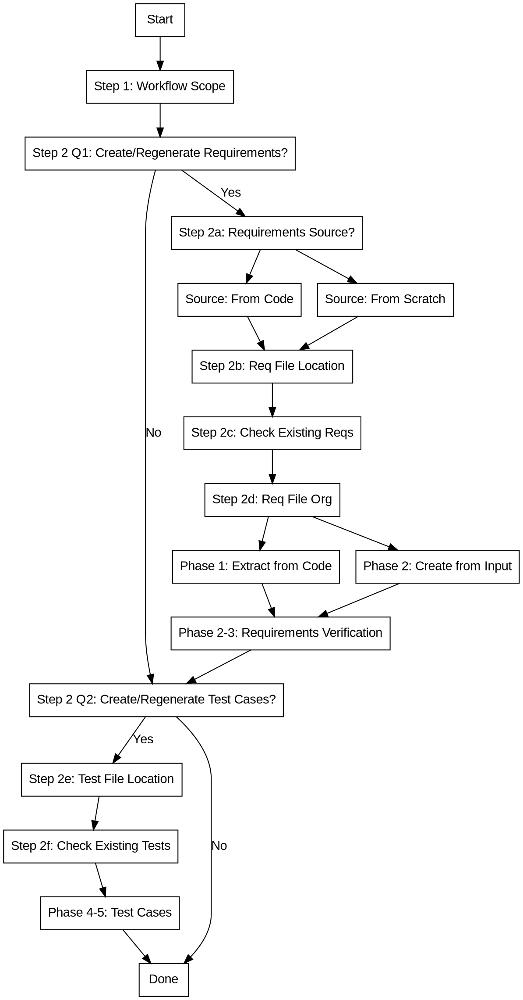

# Req-Traceability: Living Requirements with Traceability

## Overview

Create and maintain ISO/IEC/IEEE 29148 compliant requirements that serve as a **single source of truth** for what the code implements.

**Core principle:** Requirements live alongside code - not as a separate document that drifts apart.

**Three-Layer Traceability:**
- **Requirements ↔ Code**: What the system should do and where it's implemented
- **Requirements ↔ Test Specifications**: How to verify requirements are met
- **Test Specifications ↔ Code**: Which tests verify which code

## When to Use

**Use when:**
- Creating requirements that need to track code implementation
- Code has changed and requirements need updating
- Checking if requirements are in sync with current code
- Detecting deviations between requirements and implementation
- Verifying implementation matches requirements
- Managing traceability for regulated systems
- User says "requirements and code have drifted apart"

## Gotchas

- **Requirement ID format**: Use `{PREFIX}_{CATEGORY}_#####` format (e.g., `SWR_AUTH_00001`, `SWR_USER_00002`)
- **Test Case ID format**: Use `{PREFIX}_{CATEGORY}_#####` format (e.g., `UTS_AUTH_00001`, `ITS_PAYMENT_00001`)
- **Test type folders**: Unit tests → `docs/tests/unit/`, Integration tests → `docs/tests/integration/`, System tests → `docs/tests/system/`
- **Category naming**: Use uppercase short names (AUTH, USER, PAYMENT, etc.)
- **Implementation reference syntax**: Use `file.py:function` (single colon), not `file.py::function`
- **User approval required**: Never modify requirements without explicit user approval
- **Orphan code detection**: Requires reading actual implementation code

## Status Values

**Requirement status values:**

| Status | Description |
|--------|-------------|
| `Draft` | Requirement written, not yet implemented |
| `Pending` | Code exists but doesn't fully meet requirement |
| `Implemented` | Code meets requirement, recently verified |
| `Deprecated` | Requirement no longer applies |
| `Blocked` | Dependency not met, cannot proceed |
| `Rejected` | Requirement rejected (e.g., security violation, invalid request) |

**Security-related status values:**

| Status | When to Use |
|--------|-------------|
| `BLOCKED` | Path traversal detected, system directory access attempted |
| `REJECTED` | Security validation failed (secrets detected, injection patterns found) |

## Output Patterns

**Deviation detection output patterns:**

| Pattern | Description |
|---------|-------------|
| `Evidence in Code` | Found in sync report when code matches requirement |
| `Missing Requirement` | Code exists without corresponding requirement |
| `Missing Implementation` | Requirement has no corresponding code |
| `CONFLICT` | Both code and requirements changed independently |

**Test coverage output patterns:**

| Pattern | Description |
|---------|-------------|
| `Coverage Matrix` | Table mapping requirements to test cases |
| `Coverage Percentage` | Percentage of requirements with test coverage |
| `Traces-To` | Field linking test case to requirement |

## Output Structure

**ID Format:** `{PREFIX}_{CATEGORY}_#####` (e.g., `SWR_AUTH_00001`, `UTS_AUTH_00001`)

**Prefixes:**
- **SWR** - Software Requirements
- **UTS** - Unit Test Specifications
- **ITS** - Integration Test Specifications
- **SYTS** - System Test Specifications
- **ATS** - Acceptance Test Specifications

**Category Naming:** Uppercase short names (AUTH, USER, PAYMENT, API), max 10 chars

**File Naming:** `{prefix}_{category}_{type}.md` (lowercase, e.g., `swr_auth_requirements.md`)

**Default Paths:**
- Requirements → `docs/requirements/`
- Unit Tests → `docs/tests/unit/`
- Integration Tests → `docs/tests/integration/`
- System Tests → `docs/tests/system/`
- Acceptance Tests → `docs/tests/acceptance/`

**CRITICAL:** All outputs organized by category. Single-file output not supported.

**For detailed output format examples, file organization structure, and DOORS CSV format, read `references/output-structure.md`.**

## Workflow: Create/Regenerate Setup

### Step 1: Confirm Overall Workflow Scope

**CRITICAL: This is the FIRST question you MUST ask. Do NOT skip this step. Do NOT infer the user's intent from their initial message. You MUST ask this question explicitly before ANY other questions.**

Ask: **"What would you like to do?"**

**Options:**

| Option | Description | Questions Shown |
|--------|-------------|-----------------|
| **1. Interactive Mode** | Guide through creation/regeneration step-by-step | All questions |
| **2. Requirements Only** | Skip test case questions, only ask about requirements | Requirements questions only |
| **3. Test Cases Only** | Skip requirements questions, only ask about test cases | Test questions only |
| **4. Deviation Check** | Check for deviations without creation/regeneration | No confirmations |
| **5. Coverage Analysis** | Analyze test coverage gaps | No confirmations |

**Wait for user selection before proceeding.**

### Step 2: Confirm What to Create/Regenerate

**CRITICAL: Ask these questions BEFORE any setup questions. This determines which paths to follow.**

**Question 1:** **"Do you want to create or regenerate requirements?"**
- **Yes** → Ask follow-up about source, then proceed with requirements path
- **No** → Skip all requirements work, go to Question 2

**Follow-up if Question 1 = Yes:**
**"Extract requirements from current code?"**
- **Yes** → From current code (analyze existing implementation)
- **No** → From scratch (based on user input, specs, user stories)

**Question 2:** **"Do you want to create or regenerate test cases?"**
- **Yes** → Proceed with test cases path (Steps 2e, 2f)
- **No** → Skip all test case work

**Wait for explicit Yes/No for each question before proceeding.**

**IMPORTANT:** These are FULL CREATE/REGENERATE operations. If user says "Yes":
- Requirements: Create complete requirements document from chosen source (overwrites existing)
- Test cases: Create complete test specifications from requirements (overwrites existing)

### Workflow Flowchart

### Phase Overview

The skill operates in 5 phases:

| Phase | Name | Description |
|-------|------|-------------|
| **Phase 1** | Code → Requirements | Extract requirements from existing code |
| **Phase 2** | Requirements → Code | Create requirements from user input |
| **Phase 3** | Verification Loop | Validate requirements against code |
| **Phase 4** | Requirements → Test Specs | Derive test specifications |
| **Phase 5** | Traceability Matrix | Build coverage report |

**For detailed phase descriptions and step-by-step instructions, read `references/workflow-details.md`.**

### Requirements Path (Steps 2a-2d) - ONLY if Question 1 = Yes

**Step 2a: Confirm Requirements Source**

**If "Yes" to "Extract requirements from current code?":**
- Load `references/requirements-extraction.md` → Execute Phase 1

**If "No" to "Extract requirements from current code?":**
- Load `references/requirements-creation.md` → Execute Phase 2
- Ask: "What are the requirements based on? (user story, specification, design document, description)"

**Step 2b: Ask Requirements File Location**

Ask: **"Where would you like to save the requirements?"**

**Default:** `docs/requirements/`

**Step 2b-1: Prefix and Category**

**Prefix:** SWR (Software Requirements) or Custom

**Category Detection:** Automatic from code structure, or ask user

**File Format:** `{prefix}_{category}_requirements.md` (lowercase)

**Step 2c: Check for Existing Requirements**

If file exists, ask: Replace, Append, Update, or Create backup

**CRITICAL:** Always create backup before overwriting

**Step 2d: File Organization**

Ask: Single file or split by feature?

**When to split:** >100 requirements or file size >500 KB

### Test Cases Path (Steps 2e-2f) - ONLY if Question 2 = Yes

**Step 2e: Ask Test Cases File Location**

Ask: **"Where would you like to save the test cases?"**

**Default by test type:**
- **UTS** → `docs/tests/unit/`
- **ITS** → `docs/tests/integration/`
- **SYTS** → `docs/tests/system/`
- **ATS** → `docs/tests/acceptance/`

**Step 2e-1: Test Type and Category**

**Category Detection:** Automatic from requirement IDs

**Test Type Selection:**

Ask: **"What type of test specifications? (Select all that apply)"**

| Type | Prefix | Folder |
|------|--------|--------|
| Unit Tests | UTS | `docs/tests/unit/` |
| Integration Tests | ITS | `docs/tests/integration/` |
| System Tests | SYTS | `docs/tests/system/` |
| Acceptance Tests | ATS | `docs/tests/acceptance/` |
| Custom | User-defined | User-specified |

**User can select multiple types.** Generate separate files for each.

**File Format:** `{prefix}_{category}_test-specs.md` (lowercase)

**Step 2f: Check for Existing Test Cases**

Similar to Step 2c: Check if exists, ask action, create backup

## Security Validation

**MUST validate before saving.** Three security checks are required:

1. **Path Traversal Protection** - Reject `../`, `..\\`, system directories, `.ssh`/`.aws` paths
2. **Secrets Detection** - Scan for API_KEY, PASSWORD, TOKEN, CONNECTION_STRING; replace with placeholders
3. **Injection Protection** - Flag SQL injection, shell injection, eval() in verification criteria

For exact patterns, bash commands, and replacement rules, read `references/security-checks.md`.

## Deviation Detection

Deviation detection identifies when code and requirements have drifted apart.

**Deviation types (quick reference):**
- **DRIFT** - Code changed, requirements stale
- **ORPHAN_CODE** - Code exists without requirements
- **ORPHAN_REQ** - Requirements reference non-existent code
- **CONFLICT** - Both code and requirements changed

**Test deviation types:**
- **TEST_DRIFT** - Requirement changed but test specification not updated
- **UNCOVERED_REQ** - Requirement has no corresponding test coverage
- **STALE_TEST** - Test specification references a deleted requirement
- **ORPHAN_TEST** - Test code exists without test specification

For full procedures, deviation report templates, sync actions, and required output keywords, read `references/deviation-detection.md`.

## Reference Files (Load On-Demand)

**Only load these files when needed based on user selections:**

**Workflow details:**
- `references/workflow-details.md` - Detailed phase descriptions and step-by-step instructions
- `references/quality-checklist.md` - Detailed checklist for workflow compliance

**Output formats:**
- `references/output-structure.md` - Detailed output format examples and file organization

**Requirements work (Step 2 Q1 = Yes):**
- `references/requirements-extraction.md` - Load ONLY if "From code" selected (Step 2a)
- `references/requirements-creation.md` - Load ONLY if "From scratch" selected (Step 2a)
- `references/requirements-template.md` - Load ONLY if creating requirements
- `references/change-management.md` - Load for Phase 2 (Requirements -> Code)
- `references/verification-and-traceability.md` - Load for Phase 3 (Verification Loop)

**Test cases work (Step 2 Q2 = Yes):**
- `references/test-design-techniques.md` - Load ONLY if creating test cases
- `references/test-spec-template.md` - Load ONLY if creating test cases

**Supporting files (load as needed):**
- `references/security-checks.md` - Load for security validation
- `references/deviation-detection.md` - Load for deviation detection
- `references/multi-file-organization.md` - Load for file organization decisions
- `references/examples.md` - Load for complete worked examples
- `references/iso-29148.md` - Load for ISO 29148 standard details
- `references/doors-csv-format.md` - Load for DOORS CSV export
- `assets/doors-csv-template.csv` - DOORS CSV template file

## Common Pitfalls

### Critical Rules

**Workflow:**
- NEVER ask file location before confirming user wants the work
- NEVER proceed with requirements if user said "No" to Q1
- NEVER proceed with test cases if user said "No" to Q2
- NEVER skip Step 1 or assume user's intent

**Output:**
- NEVER overwrite without asking and creating backup
- NEVER create single file with 100+ requirements
- ALWAYS use `Implementation:` field (not `Source:`)
- ALWAYS include `Last Validated:` and `Last Changed:` dates

**Security:**
- NEVER accept paths with directory traversal (`../`, `..\\`)
- NEVER allow access to system directories (`/etc`, `.ssh`, `.aws`)
- NEVER save with hardcoded secrets
- NEVER include injection vulnerabilities

**For detailed checklist, read `references/quality-checklist.md`.**

## Related Skills

- **superpowers:code-review**: Analyze code changes and update requirements
- **superpowers:test-driven-development**: Create tests to verify requirements
- **superpowers:audit**: Verify compliance with requirements
