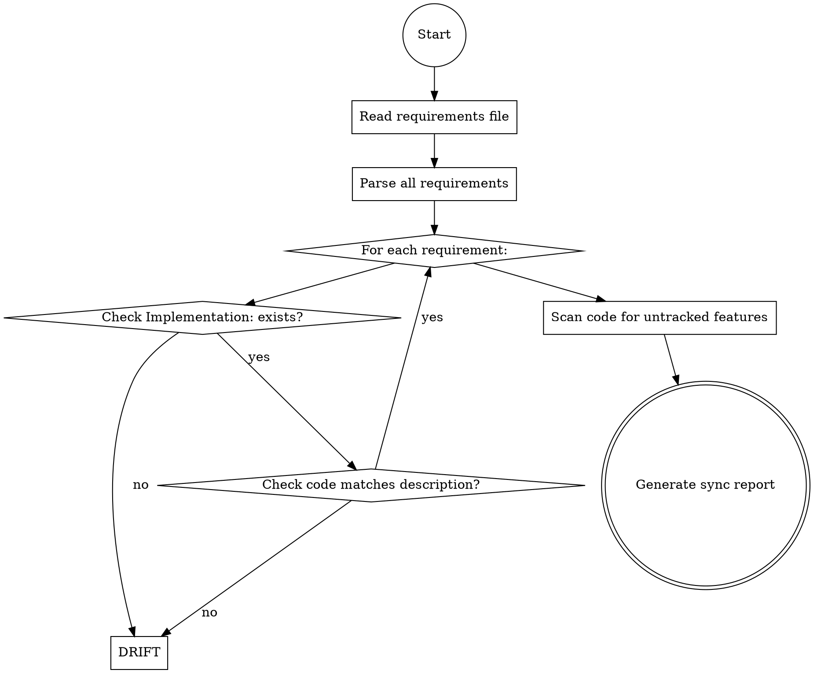

# Deviation Detection and Synchronization

This reference covers the deviation detection workflow for identifying when code and requirements have drifted apart.

## Deviation Types

| Type | Description | Example |
|------|-------------|---------|
| **DRIFT** | Code changed, requirements stale | Function signature changed but requirement still shows old signature |
| **ORPHAN_CODE** | Code exists without requirements | New feature added, no requirements documented |
| **ORPHAN_REQ** | Requirements reference non-existent code | Requirement points to deleted function |
| **CONFLICT** | Both code and requirements changed | Code behavior and requirement description diverge |

## Deviation Detection Workflow



## Step 1: Detect Deviations

**When user asks to check for deviations:**

1. **Read the requirements file** from the user-provided path
2. **Parse all requirements** and extract:
   - Requirement ID and title
   - `Implementation:` field (file path, function/class, line)
   - `Last Validated:` date
   - Description and verification criteria

3. **For each requirement:**

   **Check 1: Does the code location exist?**
   - Parse `Implementation:` field: `src/auth.py:authenticate_user (line 45)`
   - Read the source file
   - Locate the function/class at specified line
   - If not found → **ORPHAN_REQ** deviation

   **Check 2: Does code behavior match description?**
   - Read the actual code implementation
   - Compare with requirement description
   - Check verification criteria against actual behavior
   - If mismatch → **DRIFT** deviation

   **Check 3: Is the validation date recent?**
   - Compare `Last Validated:` with current date
   - If > 90 days → Flag for re-validation

4. **Scan for orphan code:**
   - Analyze the codebase for meaningful functions/classes
   - Check against all requirements' `Implementation:` fields
   - If code has no matching requirement → **ORPHAN_CODE** deviation

## Step 2: Generate Sync Report

Create a structured report showing all deviations:

```markdown
# Requirements-Code Synchronization Report

**Generated:** 2026-04-06
**Requirements File:** docs/requirement/requirements.md

## Summary

- Total Requirements: 47
- In Sync: 38
- Deviations Detected: 9
  - DRIFT: 4
  - ORPHAN_CODE: 3
  - ORPHAN_REQ: 2

## Deviations

### DRIFT: Code Changed, Requirements Stale

#### REQ-001: User Authentication
**Status:** Implemented
**Implementation:** src/auth.py:authenticate_user (line 45)
**Last Validated:** 2026-01-15 (91 days ago)

**Issue:**
Code has been modified but requirements not updated. Function now includes `require_2fa` parameter and Two-Factor Authentication logic, which is not documented in the requirement.

**Current Code:**
```python
def authenticate_user(email, password, require_2fa=False):
    # ... existing logic ...
    if require_2fa:
        send_2fa_code(user)
```

**Recommended Action:** Update requirement to reflect 2FA capability

---

### ORPHAN_CODE: Code Without Requirements

#### Untracked: src/payment/webhook_handler.py:process_stripe_webhook (line 23)
**File:** src/payment/webhook_handler.py
**Function:** process_stripe_webhook

**Issue:**
This function handles Stripe webhook events for payment processing but has no corresponding requirement.

**Code Analysis:**
```python
def process_stripe_webhook(event):
    # Processes payment_intent.succeeded, payment_intent.failed events
    # Updates order status in database
    # Sends confirmation emails
```

**Recommended Action:** Create new requirement for webhook processing

**Note:** This is **Untracked** code that exists in the implementation but has no corresponding requirement. You should create new requirement to document this functionality.

---

### ORPHAN_REQ: Requirements Without Implementation

#### REQ-034: Biometric Authentication
**Status:** Implemented
**Implementation:** src/auth.py:biometric_auth (line 120)
**Last Validated:** 2026-02-01

**Issue:**
Implementation reference points to non-existent code. Function `biometric_auth` does not exist in src/auth.py.

**Recommended Action:** Mark requirement as "Deprecated" or locate new implementation location

---

## Synchronization Options

For each deviation, you can:

**For DRIFT deviations:**
- Update requirements to match code (recommended)
- Revert code to match requirements (if change was unintentional)
- Mark for manual review (if discrepancy needs clarification)

**For ORPHAN_CODE:**
- **Create new requirement** (recommended)
- Mark code as implementation detail (if not requiring specification)

**For ORPHAN_REQ:**
- Mark requirement as "Deprecated" (if feature removed)
- Update implementation reference (if code moved)
- Mark as "Draft" if implementation planned

**For stale validations:**
- Re-run verification and update `Last Validated:` date

## Important: Required Keywords in Output

**When generating the synchronization report, you MUST include these exact keywords/phrases:**

For **ORPHAN_CODE** deviations:
- Use **"Untracked:"** in the header for each orphan code entry
- Include **"Create new requirement"** in the Recommended Action section

For **ORPHAN_REQ** deviations:
- Include **"non-existent"** when describing missing implementation
- Include **"Deprecated"** in Recommended Action options
- Reference the specific **"REQ-XXX"** format for requirement IDs

For **DRIFT** deviations:
- Include **"mismatch"** when describing the discrepancy
- Include **"Recommended Action:"** before each suggestion

For **CONFLICT** deviations (bidirectional sync):
- Include **"diverge"** when describing how code and requirements differ
- Include **"modify"** when suggesting code changes
- Include **"code changes"** or **"code changes needed"** in guidance

## Step 3: Execute Synchronization

**After user reviews report and provides choices:**

**For each approved action:**

**Update Requirements to Match Code (DRIFT):**
1. Read the current code implementation
2. Update requirement description to reflect actual behavior
3. Update `Implementation:` field with current location
4. Update verification criteria to match new behavior
5. Update `Last Validated:` to current date
6. Add to `Change Log:` with deviation type and fix

**Create New Requirements (ORPHAN_CODE):**
1. Analyze the orphan code's purpose
2. Generate new requirement following the standard template
3. Use next available requirement ID
4. Set `Status:` based on implementation state
5. Add to traceability matrix

**Mark as Deprecated (ORPHAN_REQ):**
1. Update `Status:` to "Deprecated"
2. Add to `Change Log:` explaining why deprecated
3. Remove from traceability matrix or mark as obsolete

**Update Implementation Reference:**
1. Search codebase for matching function/class
2. Update `Implementation:` field with correct location
3. Re-run verification
4. Update `Last Validated:` date

## Step 4: Verify and Report

After synchronization completes:

1. **Generate post-sync report:**
```markdown
# Synchronization Complete

**Generated:** 2026-04-06
**Changes Applied:** 9

## Actions Taken

- Updated 4 requirements to match code (DRIFT fixes)
- Created 3 new requirements for orphan code
- Deprecated 2 requirements with missing implementation
- Updated all Last Validated dates

## Updated Statistics

- Total Requirements: 50 (was 47)
- In Sync: 50
- Deviations: 0

## Files Modified

- docs/requirement/requirements.md (updated)
- docs/requirement/traceability_matrix.md (updated)

Backup created: docs/requirement/requirements.md.backup_20260406_143022
```

2. **Create backup** of original requirements file before modifying
3. **Update traceability matrix** with new mappings
4. **Ask user to review** the synchronized requirements

## When to Use Deviation Detection

Trigger this workflow when:

- User explicitly asks: "Check if my requirements are in sync with code"
- User mentions: "Requirements and code have drifted apart"
- Before a major release to verify alignment
- After significant code refactoring
- As part of regular maintenance (e.g., monthly sync check)
- When audit preparation requires verification

## User Workflow

**Typical user interaction:**

```
User: "Check if my requirements are in sync with the code"

Model: "I'll analyze your requirements against the current codebase.
       Where is your requirements file located?"

User: "docs/requirements.md"

Model: [Analyzes requirements, detects deviations, generates sync report]

Model: "Found 9 deviations. Here's the report:
       [Shows sync report with all deviations]

       How would you like to handle each deviation?
       For each, choose: update-req, create-req, deprecate, or review"

User: "For DRIFT items: update-req. For ORPHAN_CODE: create-req. For ORPHAN_REQ: deprecate"

Model: [Executes synchronization, creates backup, updates files]

Model: "Synchronization complete. Updated 4 requirements, created 3 new ones,
       deprecated 2. Backup saved. Here's the post-sync report."
```

## Deviation Detection Checklist

**Before running detection:**
- [ ] User has provided requirements file path
- [ ] Requirements file exists and is readable
- [ ] Codebase is accessible for analysis

**During detection:**
- [ ] All requirements parsed correctly
- [ ] Implementation fields validated against actual code
- [ ] Code behavior compared with descriptions
- [ ] Orphan code identified
- [ ] All deviations categorized correctly

**After synchronization:**
- [ ] Backup of original requirements created
- [ ] All approved actions executed
- [ ] `Last Validated:` dates updated for affected requirements
- [ ] Change log entries added
- [ ] Traceability matrix updated
- [ ] Post-sync report generated
