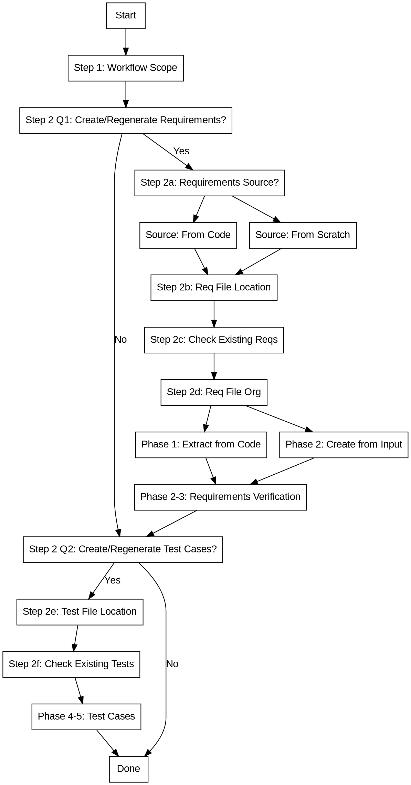

# Sync-Req: Living Requirements with Traceability

## Overview

Create and maintain ISO/IEC/IEEE 29148 compliant requirements that serve as a **single source of truth** for what the code implements.

**Core principle:** Requirements live alongside code - not as a separate document that drifts apart.

**Three-Layer Traceability:**
- **Requirements ↔ Code**: What the system should do and where it's implemented
- **Requirements ↔ Test Specifications**: How to verify requirements are met
- **Test Specifications ↔ Code**: Which tests verify which code

## When to Use

**Use when:**
- Creating requirements that need to track code implementation
- Code has changed and requirements need updating
- Checking if requirements are in sync with current code
- Detecting deviations between requirements and implementation
- Verifying implementation matches requirements
- Managing traceability for regulated systems
- User says "requirements and code have drifted apart"

## Gotchas

- **Requirement ID format**: Must use `REQ-###` format (REQ-001, REQ-002, etc.)
- **Test Case ID format**: Must use `TC-###` format (TC-001, TC-002, etc.)
- **Implementation reference syntax**: Use `file.py:function` (single colon), not `file.py::function`
- **User approval required**: Never modify requirements without explicit user approval
- **Orphan code detection**: Requires reading actual implementation code

## Status Values

**Requirement status values:**

| Status | Description |
|--------|-------------|
| `Draft` | Requirement written, not yet implemented |
| `Pending` | Code exists but doesn't fully meet requirement |
| `Implemented` | Code meets requirement, recently verified |
| `Deprecated` | Requirement no longer applies |
| `Blocked` | Dependency not met, cannot proceed |
| `Rejected` | Requirement rejected (e.g., security violation, invalid request) |

**Security-related status values:**

| Status | When to Use |
|--------|-------------|
| `BLOCKED` | Path traversal detected, system directory access attempted |
| `REJECTED` | Security validation failed (secrets detected, injection patterns found) |

## Output Patterns

**Deviation detection output patterns:**

| Pattern | Description |
|---------|-------------|
| `Evidence in Code` | Found in sync report when code matches requirement |
| `Missing Requirement` | Code exists without corresponding requirement |
| `Missing Implementation` | Requirement has no corresponding code |
| `CONFLICT` | Both code and requirements changed independently |

**Test coverage output patterns:**

| Pattern | Description |
|---------|-------------|
| `Coverage Matrix` | Table mapping requirements to test cases |
| `Coverage Percentage` | Percentage of requirements with test coverage |
| `Traces-To` | Field linking test case to requirement |

## Workflow: Create/Regenerate Setup

### Step 1: Confirm Overall Workflow Scope

**CRITICAL: This is the FIRST question you MUST ask. Do NOT skip this step. Do NOT infer the user's intent from their initial message. You MUST ask this question explicitly before ANY other questions.**

Ask: **"What would you like to do?"**

**Options:**

| Option | Description | Questions Shown |
|--------|-------------|-----------------|
| **1. Interactive Mode** | Guide through creation/regeneration step-by-step | All questions |
| **2. Requirements Only** | Skip test case questions, only ask about requirements | Requirements questions only |
| **3. Test Cases Only** | Skip requirements questions, only ask about test cases | Test questions only |
| **4. Deviation Check** | Check for deviations without creation/regeneration | No confirmations |
| **5. Coverage Analysis** | Analyze test coverage gaps | No confirmations |

**Wait for user selection before proceeding.**

### Step 2: Confirm What to Create/Regenerate

**CRITICAL: Ask these questions BEFORE any setup questions. This determines which paths to follow.**

**Question 1:** **"Do you want to create or regenerate requirements?"**
- **Yes** → Ask follow-up about source (code or scratch), then proceed with requirements path
- **No** → Skip all requirements work, go to Question 2

**Follow-up if Question 1 = Yes:**
**"What is the source for requirements?"**
- **Option A:** From current code (analyze existing implementation)
- **Option B:** From scratch (based on user input, specs, user stories)

**Question 2:** **"Do you want to create or regenerate test cases?"**
- **Yes** → Proceed with test cases path (Steps 2e, 2f)
- **No** → Skip all test case work

**Wait for explicit Yes/No for each question before proceeding.**

**IMPORTANT:** These are FULL CREATE/REGENERATE operations. If user says "Yes":
- Requirements: Create complete requirements document from chosen source (overwrites existing)
- Test cases: Create complete test specifications from requirements (overwrites existing)

### Workflow Flowchart

### Requirements Path (Steps 2a-2d) - ONLY if Question 1 = Yes

**Step 2a: Confirm Requirements Source**

**CRITICAL: Only ask this question if user answered "Yes" to Question 1.**

**If user selected "From current code":**
- Load `references/requirements-extraction.md` for extraction details
- Requirements will be extracted from existing codebase
- Phase 1 (Code -> Requirements) will be executed

**If user selected "From scratch":**
- Load `references/requirements-creation.md` for creation details
- Ask: "What are the requirements based on? (user story, specification, design document, description)"
- Requirements will be created from user input
- Phase 1 (Code -> Requirements) is SKIPPED - go directly to Phase 2

**Proceed to Step 2b after source is confirmed.**

**Step 2b: Ask Requirements File Location**

**CRITICAL: Only ask this question if user answered "Yes" to Question 1.**

Ask: **"Where would you like to save the requirements?"**

**User may specify:**
- A specific file path: `requirements.md`, `docs/requirements.md`
- A directory: `custom_docs/`, `requirements/`
- An absolute path: `/path/to/output/requirements.md`

**Default behavior ONLY if user declines to specify:**
- Save to `docs/requirement/requirements.md`

**Step 2c: Check for Existing Requirements**

**CRITICAL: Only ask this question if user answered "Yes" to Question 1.**

After getting the output path, check if requirements already exist:

1. If the file exists, ask: "Requirements already exist at [path]. What would you like to do?"
   - **Option A:** Replace completely (create new requirements from scratch)
   - **Option B:** Append new requirements to existing file
   - **Option C:** Update existing requirements in place
   - **Option D:** Create a new version/backup first

2. **CRITICAL: Create backup before modifying existing requirements:**
   - Backup format: `requirements.md.backup_YYYYMMDD_HHMMSS`
   - Always backup when overwriting or updating
   - Never delete original file without backup

3. Require explicit user confirmation: "Are you sure you want to overwrite [path]? Type 'yes' to confirm."

**Step 2d: Determine Requirements File Organization**

**CRITICAL: Only ask this question if user answered "Yes" to Question 1.**

Ask the user if they want: Single file, split by feature, or split by type.

**When to split:** >100 requirements, multiple distinct features, or file size >500 KB.

For directory structures, index.md templates, and multi-file best practices, read `references/multi-file-organization.md`.

### Test Cases Path (Steps 2e-2f) - ONLY if Question 2 = Yes

**Step 2e: Ask Test Cases File Location**

**CRITICAL: Only ask this question if user answered "Yes" to Question 2.**

Ask: **"Where would you like to save the test cases?"**

**User may specify:**
- A specific file path: `tests/test-specifications.md`, `docs/tests.md`
- A directory: `tests/`, `test-specs/`
- An absolute path: `/path/to/output/test-cases.md`

**Default behavior ONLY if user declines to specify:**
- Save to `tests/test-specifications.md`

**Step 2f: Check for Existing Test Cases**

**CRITICAL: Only ask this question if user answered "Yes" to Question 2.**

Similar to Step 2c but for test cases:
- Check if test cases file exists
- Ask: Replace, Append, Update, or Create backup
- Create backup with timestamp
- Require explicit confirmation for overwrite

## Security Validation

**MUST validate before saving.** Three security checks are required:

1. **Path Traversal Protection** - Reject `../`, `..\\`, system directories, `.ssh`/`.aws` paths
2. **Secrets Detection** - Scan for API_KEY, PASSWORD, TOKEN, CONNECTION_STRING; replace with placeholders
3. **Injection Protection** - Flag SQL injection, shell injection, eval() in verification criteria

For exact patterns, bash commands, and replacement rules, read `references/security-checks.md`.

## Deviation Detection

Deviation detection identifies when code and requirements have drifted apart.

**Deviation types (quick reference):**
- **DRIFT** - Code changed, requirements stale
- **ORPHAN_CODE** - Code exists without requirements
- **ORPHAN_REQ** - Requirements reference non-existent code
- **CONFLICT** - Both code and requirements changed

**Test deviation types:**
- **TEST_DRIFT** - Requirement changed but test specification not updated
- **UNCOVERED_REQ** - Requirement has no corresponding test coverage
- **STALE_TEST** - Test specification references a deleted requirement
- **ORPHAN_TEST** - Test code exists without test specification

For full procedures, deviation report templates, sync actions, and required output keywords, read `references/deviation-detection.md`.

## Reference Files (Load On-Demand)

**Only load these files when needed based on user selections:**

**Requirements work (Step 2 Q1 = Yes):**
- `references/requirements-extraction.md` - Load ONLY if "From code" selected (Step 2a)
- `references/requirements-creation.md` - Load ONLY if "From scratch" selected (Step 2a)
- `references/requirements-template.md` - Load ONLY if creating requirements
- `references/change-management.md` - Load for Phase 2 (Requirements -> Code)
- `references/verification-and-traceability.md` - Load for Phase 3 (Verification Loop)

**Test cases work (Step 2 Q2 = Yes):**
- `references/test-design-techniques.md` - Load ONLY if creating test cases
- `references/test-spec-template.md` - Load ONLY if creating test cases

**Supporting files (load as needed):**
- `references/security-checks.md` - Load for security validation
- `references/deviation-detection.md` - Load for deviation detection
- `references/multi-file-organization.md` - Load for file organization decisions
- `references/examples.md` - Load for complete worked examples
- `references/iso-29148.md` - Load for ISO 29148 standard details
- `references/doors-csv-format.md` - Load for DOORS CSV export
- `assets/doors-csv-template.csv` - DOORS CSV template file

**Token savings:**
- User skips requirements → saves ~200 tokens (no requirement content loaded)
- User skips test cases → saves ~150 tokens (no test content loaded)
- User skips both → saves ~350 tokens (only workflow steps loaded)

## Common Pitfalls

### Don't Do This

**CRITICAL: These are deal-breakers. If you do these, you've failed.**

- **NEVER ask file location questions before confirming user wants to do the work** - Confirmations first (Step 2), then setup (Steps 2a-2f)
- **NEVER proceed with requirements work if user said "No" to Question 1** - Skip all requirements steps
- **NEVER proceed with test case work if user said "No" to Question 2** - Skip all test case steps
- **NEVER assume requirements always come from code** - Confirm source (code or scratch) before proceeding
- **NEVER skip the Output Path field** - Document header MUST include `**Output Path:**`
- **NEVER overwrite existing requirements without asking** - Always check if file exists and ask what action to take
- **NEVER create a single file with 100+ requirements** - Split into multiple files when requirements get large
- **NEVER skip creating index.md when splitting files** - Always provide navigation
- **NEVER automatically update requirements or tests without user approval**
- **NEVER skip Step 1 or make assumptions about user's intent** - MUST ask "What would you like to do?" FIRST, no exceptions
- **NEVER skip test derivation for functional requirements** - All functional requirements need test coverage
- Use "Source:" instead of "Implementation:" - MUST use `Implementation:` field
- Omit "Last Validated:" and "Last Changed:" dates - Every requirement needs these

### Security Pitfalls

- **NEVER accept paths with directory traversal** - Reject `../`, `..\\`, `%2e%2e%2f`
- **NEVER allow access to system directories** - Block `/etc`, `/var`, `.ssh`, `.aws`
- **NEVER save requirements with hardcoded secrets** - Detect and replace
- **NEVER overwrite files without backup** - Always create timestamped backup
- **NEVER include injection vulnerabilities in verification** - Flag SQL/shell/eval patterns

### Do This

- **ALWAYS ask "What would you like to do?" FIRST** - Before ANY other question, before ANY inference, before proceeding
- **Wait for user response** - Do not make assumptions from their initial message
- **Follow the workflow in order** - Step 1 → Step 2 → (Step 2a-2f only if confirmed)
- **Ask confirmations BEFORE setup questions** - Step 2 questions come before file location questions

## Quality Checklist

**BEFORE YOU DO ANYTHING ELSE:**
- [ ] **Completed Step 1** - Confirmed workflow scope
- [ ] **Completed Step 2** - Got explicit Yes/No for requirements and test cases

**Requirements path (only if Step 2 Q1 = Yes):**
- [ ] **Confirmed requirements source** - From code or from scratch
- [ ] **If from code: Loaded `references/requirements-extraction.md` and will execute Phase 1**
- [ ] **If from scratch: Loaded `references/requirements-creation.md`, Phase 1 skipped, Phase 2 starts with user input**
- [ ] **Asked "Where would you like to save the requirements?"** - Only if creating/regenerating requirements
- [ ] **Waited for user response**
- [ ] **Checked if requirements file exists**
- [ ] **Created backup if needed**
- [ ] **Got explicit confirmation for overwrite**
- [ ] **Determined file organization**

**Test cases path (only if Step 2 Q2 = Yes):**
- [ ] **Asked "Where would you like to save the test cases?"** - Only if creating/regenerating test cases
- [ ] **Waited for user response**
- [ ] **Checked if test cases file exists**
- [ ] **Created backup if needed**
- [ ] **Got explicit confirmation for overwrite**

## Related Skills

- **superpowers:code-review**: Analyze code changes and update requirements
- **superpowers:test-driven-development**: Create tests to verify requirements
- **superpowers:audit**: Verify compliance with requirements
