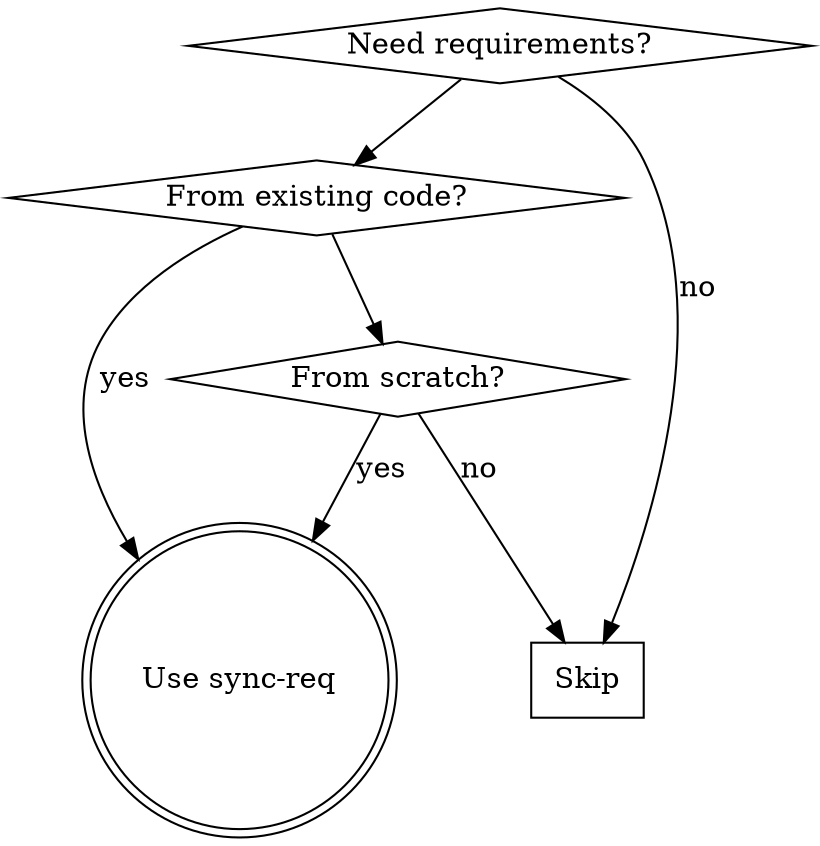

# Sync-Req: ISO 29148 Requirements Engineering

## Overview

Generate ISO/IEC/IEEE 29148:2018 compliant software requirements through bidirectional workflows:
- **Reverse engineering**: Extract requirements from existing code
- **Forward engineering**: Create requirements from user stories
- **Multi-format output**: Markdown, Excel, DOORS-compatible CSV

Core principle: Transform code semantics or user intent into structured ISO 29148 requirements.

## When to Use



**Use when:**
- User mentions "requirements specification" or "ISO standards"
- Need to document what code implements
- Creating requirements from user stories
- Need DOORS import format
- Any language: Python, JavaScript/TypeScript, Go, Java, C/C++

**NOT for:**
- Simple code summaries without ISO structure
- Non-technical documentation

## Quick Reference

### Workflow Steps

| Step | Action | Output |
|------|--------|--------|
| 1 | Determine input method | Reverse or forward engineering |
| 2 | Analyze code or gather requirements | Requirement semantics |
| 3 | Extract requirements | Requirement list |
| 4 | Classify by ISO 29148 sections | Categorized requirements |
| 5 | Generate verification criteria | Acceptance tests |
| 6 | Format output | .md/.xlsx/.csv file |

### ISO 29148 Sections

| Section | Description | Example |
|---------|-------------|---------|
| Functional | What the system shall do | "System shall authenticate users" |
| Non-Functional | Quality attributes | "API response time < 200ms" |
| Interface | External interfaces | "REST API with JSON responses" |
| Data | Data structures, storage | "User data stored in PostgreSQL" |
| Verification | How to verify | "Verify LDAP login succeeds" |

### Language Detection

| Extension | Language |
|-----------|----------|
| .py | Python |
| .js, .ts | JavaScript/TypeScript |
| .go | Go |
| .java | Java |
| .c, .cpp, .h | C/C++ |

## Reverse Engineering

### Using the Tool

**PREFERRED METHOD** - Use the automated tool for Python code:

```bash
python tools/extract_requirements.py src/auth.py -o requirements.md -f md
python tools/extract_requirements.py src/auth.py -o requirements.csv -f csv
python tools/extract_requirements.py src/auth.py -o requirements.json -f json
```

**Tool capabilities:**
- Python analyzer fully implemented
- Detects functions, classes, constants
- Infers priority from naming patterns
- Generates verification criteria
- Outputs to Markdown, CSV, or JSON

### Manual Analysis (Fallback)

When analyzing code manually (for languages other than Python):

1. **Detect language** from file extension
2. **Analyze structure**: identify functions, classes, interfaces
3. **Extract semantics**: understand what code does
4. **Classify by ISO 29148 sections**: map code patterns to requirement types
5. **Generate verification criteria**: define how to verify each requirement

**Language-specific patterns:**
- **Python**: Functions → Functional, decorators → Interface, type hints → Data
- **JavaScript/TypeScript**: Functions → Functional, types → Data, exports → Interface
- **Go**: Functions → Functional, structs → Data, packages → Interface
- **Java**: Classes → Functional, interfaces → Contract, annotations → Metadata
- **C/C++**: Functions → Functional, headers → Interface

### Using the Tool

For automated extraction:

```bash
python tools/extract_requirements.py src/auth.py -o requirements.md -f md
python tools/extract_requirements.py src/auth.py -o requirements.csv -f csv
python tools/extract_requirements.py src/auth.py -o requirements.json -f json
```

**Tool capabilities:**
- Python analyzer fully implemented
- Detects functions, classes, constants
- Infers priority from naming patterns
- Generates verification criteria
- Outputs to Markdown, CSV, or JSON

## Forward Engineering

### Process

1. **Gather inputs**: user stories, business requirements
2. **Identify scope**: define system boundaries
3. **Extract requirements**: translate business to technical
4. **Classify by ISO 29148 sections**
5. **Define verification criteria**
6. **Assign metadata**: priority, status, rationale

### Guiding Questions

Ask users:
- **Functional**: What should the system do? Core features?
- **Non-Functional**: Performance targets? Security? Reliability?
- **Interface**: External integrations? API specifications?
- **Data**: Storage requirements? Validation rules?
- **Verification**: How will we know this is met?

## Output Formats

### Markdown

**Use for:** Human-readable docs, version control, code review

**Reference:** `requirements-template.md`

### Excel

**Use for:** Stakeholder reviews, business analysis, offline editing

**Columns:** ID, Text, Type, Priority, Status, Verification, Parent_ID, Source, Rationale

### CSV (DOORS)

**Use for:** Importing to DOORS or other requirements tools

**Reference:** `doors-csv-format.md`
**Template:** `doors-csv-template.csv`

**Critical rules:**
- UTF-8 encoding mandatory
- Unix line endings (`\n`)
- Quote fields with commas/newlines
- Escape quotes as `""`

## Common Mistakes

| Mistake | Fix |
|---------|-----|
| Writing implementation details instead of requirements | Focus on WHAT, not HOW. Use "System shall" |
| Missing verification criteria | Always include verification for each requirement |
| Using vague language | Use specific, measurable terms ("< 200ms" not "fast") |
| Confusing functional and non-functional | Functional = behavior, Non-Functional = quality attributes |
| Wrong CSV format for DOORS | Follow exact column structure in reference doc |
| Not using "shall" language | ISO 29148 requires "shall" for mandatory requirements |
| Multiple requirements in one item | Split complex requirements individually |

## Red Flags - STOP

**Before proceeding, verify ALL checkboxes:**

- [ ] No "System should" - must use "shall" per ISO 29148
- [ ] Every requirement has verification criteria (no exceptions)
- [ ] Requirements are WHAT, not HOW (no implementation details)
- [ ] Each requirement has unique ID in REQ-### format
- [ ] All requirements have priority assigned
- [ ] Source attribution tracked for reverse-engineered requirements
- [ ] CSV format matches DOORS specification (if using CSV)
- [ ] UTF-8 encoding for international characters
- [ ] No vague terms (fast, good, adequate) - use measurable metrics

**Common Rationalizations and Reality:**

| Rationalization | Reality |
|-----------------|---------|
| "Verification criteria are obvious" | Not to implementers. Write it down. |
| "I'll add verification later" | Never happens. Do it now. |
| "The requirement speaks for itself" | No, it doesn't. Testers need criteria. |
| "User wants it quick" | Quick without verification = useless. |
| "This is a simple requirement" | Simple still needs testable criteria. |

**All of these mean: Fix before proceeding.**

## Related

For requirements workflows:
- **superpowers:writing-plans**: Create implementation plans from requirements
- **superpowers:test-driven-development**: Verify requirements with tests

## References

- **ISO 29148 Reference**: See `iso-29148-reference.md`
- **DOORS CSV Format**: See `doors-csv-format.md`
- **Skills specification**: https://agentskills.io/specification
- **Skill creation**: superpowers:writing-skills (TDD approach)